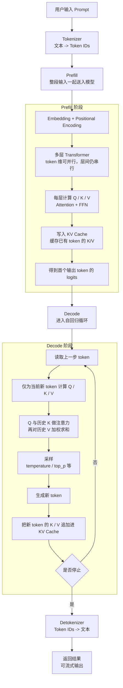

### 1. 文档目的

本文整理了最近对 **Prefill / Decode**、**KV Cache**、**Tokenizer**、**Multi-Head Self-Attention** 的一些了解，粗浅的梳理下大语言模型（LLM）的**工作原理**，重点聚焦推理（Inference）流程。

---

### 2. LLM 整体推理流程（端到端）

从用户输入 Prompt 到最终返回文本，LLM 的推理过程通常可概括为两大阶段：Prefill 和 Decode。



**关键指标**：

- **TTFT**（Time To First Token）：主要由 Prefill 决定
- **TPOT**（Time Per Output Token）：主要由 Decode 决定

---

### 3. Tokenizer 的作用

Tokenizer 是整个流程的**入口**：

- 把人类文本（Prompt）转换为模型可处理的 **Token IDs**（整数序列）。
- Prefill 阶段必须先完成 Tokenization。
- Decode 阶段结束后，Detokenizer 把 Token IDs 转回可读文本。
- Token 数量直接影响 Prefill 计算量（越少越快）。

---

### 4. Prefill 阶段详解（一次性并行）

Prefill 是“读题 + 建记忆”的阶段，包含以下步骤：

1. **Embedding + Positional Encoding**（RoPE 等）
2. **多层 Transformer**（每层重复）：
   - **Multi-Head Self-Attention**（核心，见第 6 节）
   - **Feed-Forward Network (FFN)**
3. **构建并填充 KV Cache**（所有输入 token 的 K 和 V 一次性缓存）
4. 生成**第一个输出 Token** 的 Logits

这里“并行”主要指 token 维度可以一起算；但层与层之间仍要按顺序前进，因此并不是整个网络完全并行。

**特点**：更偏计算密集型（Compute-bound），GPU 利用率通常较高。

---

### 5. Decode 阶段详解（自回归循环）

Decode 是“一句一句写答案”的阶段，使用 Prefill 阶段已缓存的 KV Cache：

- 每次只处理 **1 个新 token**
- 复用历史 KV Cache，避免在每一步把整段历史 token 的 K/V 都重算一遍
- 对当前 token 计算新的 Q/K/V；再用它的 Q 与历史 K 做匹配、对历史 V 做加权求和；然后经过 FFN、采样生成新 Token，并把新 K/V 追加到 KV Cache
- 重复直到 EOS 或 max_tokens

**特点**：访存密集型（Memory-bound），串行执行。

---

### 6. Multi-Head Self-Attention 原理

**Multi-Head Self-Attention** 是 Transformer 的核心，让模型同时从多个不同“视角”捕捉词间关系。

#### 6.1 Q、K、V 的直观含义

- **Query (Q)**：当前词“想问的问题”
- **Key (K)**：其他词的“身份标签 / 目录”（用来被匹配）
- **Value (V)**：其他词的“实际内容”（被提取的信息）

**比喻**：你在图书馆找书，Query 是你的问题，Key 是每本书的目录卡，Value 是书的内容。先用目录匹配，再按匹配度提取内容。

#### 6.2 极简手算示例（把 K、V 的来源也算出来）

为了把 `K`、`V` 的来历看清楚，下面不用“Q/K/V 直接等于 Embedding”这个偷懒设定，而是显式给出三个投影矩阵。  
为便于手算，我们先**忽略位置编码和 causal mask**，只演示 `Q = XW_Q`、`K = XW_K`、`V = XW_V` 以及后续注意力计算。真实 LLM 在 decoder 里还会额外加上因果掩码，禁止看到未来 token。

**输入 token**：我 爱 你

**Embedding 矩阵 `X`**（每行是一个 token 的向量）：

```text
我 = [1, 0, 0]
爱 = [0, 1, 0]
你 = [0, 0, 1]

X =
[1 0 0]
[0 1 0]
[0 0 1]
```

**手工指定投影矩阵**：

```text
W_Q =
[1 0]
[0 1]
[0 0]

W_K =
[1 1]
[0 1]
[1 0]

W_V =
[1 0]
[1 1]
[0 1]
```

**先算 Q、K、V**：

```text
Q = XW_Q =
[1 0]
[0 1]
[0 0]

K = XW_K =
[1 1]
[0 1]
[1 0]

V = XW_V =
[1 0]
[1 1]
[0 1]
```

这一步就能看到：

- “我”的 Query 是 `[1, 0]`
- “爱”的 Key 是 `[0, 1]`
- “你”的 Value 是 `[0, 1]`

也就是说，`Q/K/V` 不是凭空冒出来的，而是同一个输入向量 `X` 分别乘上三个不同的可训练矩阵 `W_Q / W_K / W_V` 得到的。

**再算注意力分数 `QK^T`**：

```text
QK^T =
[1 0] ·
[1 0 1]
[1 1 0]
=
[1 0 1]
[1 1 0]
[0 0 0]
```

更直观地按行理解：

- “我”的 Query `[1, 0]` 分别和三个 Key 点积，得到 `[1, 0, 1]`
- “爱”的 Query `[0, 1]` 分别和三个 Key 点积，得到 `[1, 1, 0]`
- “你”的 Query `[0, 0]` 分别和三个 Key 点积，得到 `[0, 0, 0]`

**Scaled Scores**（`d_k = 2`，所以除以 `sqrt(2) ≈ 1.414`）：

```text
[0.71 0.00 0.71]
[0.71 0.71 0.00]
[0.00 0.00 0.00]
```

**Softmax 后的注意力权重**（四舍五入）：

```text
我 -> [0.40, 0.20, 0.40]
爱 -> [0.40, 0.40, 0.20]
你 -> [0.33, 0.33, 0.33]
```

**最后做加权求和 `Attention(Q,K,V) = softmax(QK^T / sqrt(d_k)) V`**：

```text
我 -> 0.40*[1,0] + 0.20*[1,1] + 0.40*[0,1] = [0.60, 0.60]
爱 -> 0.40*[1,0] + 0.40*[1,1] + 0.20*[0,1] = [0.80, 0.60]
你 -> 0.33*[1,0] + 0.33*[1,1] + 0.33*[0,1] = [0.67, 0.67]
```

**结论**：

- `Q/K/V` 都来自同一个输入 `X`，只是投影矩阵不同
- 注意力权重由 `Q` 和 `K` 的相似度决定
- 真正被加权汇总的是 `V`
- 所以可以把它理解成：`Q` 决定“看谁”，`K` 决定“怎么匹配”，`V` 决定“拿走什么信息”

---

### 7. 采样参数（temperature & top_p）

- **temperature**：控制概率分布的“平坦度”（低值 → 确定性，高值 → 创意）
- **top_p**（Nucleus Sampling）：动态截取累计概率 ≥ p 的候选词池
  - top_p = 1.0：相当于完全不设围栏（纯 temperature 采样）

**推荐组合**：

- 事实/代码任务：temperature 0.0~0.3 + top_p 0.9~1.0
- 聊天/创意：temperature 0.7~1.0 + top_p 0.92~0.98

---

### 8. KV Cache 核心机制

- **数据结构**：每层保存 `past_key_values`，形状为 `[batch, num_heads, past_seq_len, head_dim]`
- Prefill：一次性填充所有输入 token 的 K/V
- Decode：每次只追加 1 个新 token 的 K/V
- 作用：避免在每个 decode step 反复重算整段历史 token 的 K/V；因此每步主要只新增当前 token 的投影计算，再对历史做一次线性扫描，显著加速推理
