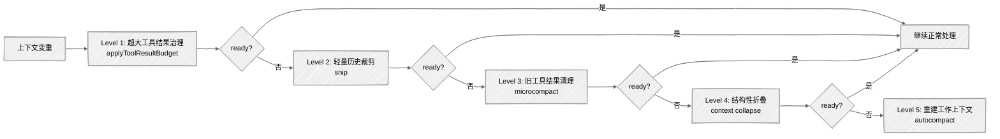

> 本文源自 Claude Code 的 Query Loop 实现分析，研究其上下文治理策略并从中提炼关键策略

众所周知， Claude Code 昨天开源了，对于做 Agent 的个人和团队都是一个很好的借鉴，从目前放出来的代码量看，大概体量如下(统计自 src 目录， 源码在 https://github.com/cjraft/claude-code)：

```bash
-------------------------------------------------------------------------------
Language                     files          blank        comment           code
-------------------------------------------------------------------------------
TypeScript                    1884          35799          86830         390587
JavaScript                       2              0              0              5
-------------------------------------------------------------------------------
SUM:                          1886          35799          86830         390592
-------------------------------------------------------------------------------
```

共计 39万行代码，着实有点多， 先从最关心的几个部分开始：上下文管理、 prompt cache、 性能优化策略、 system prompt， 本篇文章聚焦 Claude Code 的**上下文管理**部分。

## 一、上下文治理的架构



**关键原则**：每一层都比下一层更便宜、更保守；前一层能解决，就不进入后一层。

---

## 二、Level 1：超大工具结果治理

### 2.1 问题场景

假设 Agent 一次并行调用了两个工具：

1. `Grep("TODO|FIXME")` → 返回 18KB 文本
2. `Bash("git diff")` → 返回 120KB 文本

在本地 transcript 里，这可能是两条独立的 user message。但发送给模型前，连续的 user message 会被合并，模型实际看到的是**一条 138KB 的超大 message**。

### 2.2 解决方案

**核心思路**：如果某一轮工具返回的正文太长，先把"原始大结果"存到磁盘，只把一个较短的预览版本继续放进上下文。

```typescript
// 伪代码示意
messagesForQuery = await applyToolResultBudget(
  messagesForQuery,
  contentReplacementState,
  persistReplacements,
  toolsWithoutSizeLimit,
);
```

### 2.3 关键设计点

”预览版本“大概长这样：

1. 一段 preview
2. 原始结果的本地保存路径
3. 原始结果的大小信息

也就是说，模型拿到的不是：

```text
tool_result bash_1:
"结果过长，省略"
```

而更接近：

```text
tool_result bash_1:
<persisted-output>
Output too large (120KB). Full output saved to: .../tool-results/bash_1.txt

Preview (first 2KB):
... 前 2KB 的真实输出内容 ...
...
</persisted-output>
```

这背后的思想不是“把工具结果藏起来”，而是：

- 先给模型一个信息量足够大的 preview
- 再把完整原文放到按需可读的位置

这样做通常比把几十 KB 甚至上百 KB 的原始输出直接塞进 prompt 更合理。对于 `Grep` 这类工具，模型往往先看 preview 就能判断方向；如果不够，再进一步：

- 缩小 grep 范围重试
- 读取持久化后的完整结果文件
- 调整搜索条件

所以可以把 `Level 1` 理解成：

> 不是丢掉大结果，而是把“全文直塞 prompt”改成“preview + 路径 + 按需再读”。

### 2.4 适用场景总结

- **目标**：新产生的超大 tool_result
- **策略**：替换为持久化的预览版本
- **优势**：对原有消息结构破坏最小，优先保证 prompt cache 稳定
- **局限**：只处理最容易失控的 tool_result，不处理历史累积问题

---

## 三、Level 2：轻量历史裁剪

### 3.1 定位

`snip` 像是"先随手收拾一下房间"，把一些可以直接删掉的旧历史先裁掉，**尽量避免太早进入更重的 compact**。

它位于：

- `applyToolResultBudget` 之后
- `microcompact` 和 `autocompact` 之前

### 3.2 核心思路

> 如果前面已经把超大的工具结果治理过了，但历史里可能还残留一些"现在不太重要、直接删掉也问题不大"的旧内容——如果这些内容删掉以后，上下文就回到安全区，那就没必要继续走更重的 compact。

### 3.3 关键设计点

#### 3.3.1 显式传递瘦身成果

```typescript
const snipResult = snipCompactIfNeeded(messagesForQuery);
messagesForQuery = snipResult.messages;
snipTokensFreed = snipResult.tokensFreed; // 关键！
```

`tokensFreed` 会继续传给 `autocompact`，避免系统误判：

- 实际上 snip 已经删掉一部分历史
- 但阈值判断还以为上下文依然很大
- 于是过早触发 autocompact

#### 3.3.2 结构化痕迹保留

如果 `snip` 返回了 `boundaryMessage`，说明它不是一次完全隐形的内存操作，而是把"这里发生过裁剪"记录到消息流里。

#### 3.3.3 一个更具体的例子

虽然当前仓库里看不到 `snipCompact` 的实现文件，但从调用契约和周边代码，可以比较保守地推断：`snip` 更像是“按消息边界裁掉一段旧历史”，而不是做摘要。

比如当前工作历史可能是这样：

```text
user: 帮我检查 query.ts 的上下文治理逻辑
assistant: 我先 grep 一下 compact 相关实现
assistant: tool_use grep_1
user: tool_result grep_1
assistant: 我看到 compact.ts / autoCompact.ts / microCompact.ts
user: 再看看 session memory 路径
assistant: tool_use read_1
user: tool_result read_1
assistant: 这里能看到 sessionMemoryCompact...
user: 顺便解释一下 prompt cache
assistant: ...
```

如果这时候上下文开始变重，但又还没重到需要 `microcompact` 或 `autocompact`，`snip` 很可能会做一种类似下面的事情：

```text
[Snip boundary]
……前面一段较旧历史已经被裁掉……

assistant: 我看到 compact.ts / autoCompact.ts / microCompact.ts
user: 再看看 session memory 路径
assistant: tool_use read_1
user: tool_result read_1
assistant: 这里能看到 sessionMemoryCompact...
user: 顺便解释一下 prompt cache
assistant: ...
```

也就是说，它更像：

- 直接从当前工作视图里切掉一段更老的历史
- 保留较新的、仍然和当前任务强相关的消息
- 同时留下一个 snip boundary / marker，让系统知道这里发生过裁剪

- **能确认的**：`snip` 会返回新的 `messages`、`tokensFreed`，有时还会返回 `boundaryMessage`
- **不能确认的**：在当前这份源码快照里，看不到 `snipCompact` 的具体实现文件，所以不能武断写死它内部到底按什么规则裁剪

因此更稳妥的描述应该是：

> `snip` 是一层带边界和投影语义的轻量历史裁剪，它会缩短当前工作消息视图，但不等于 full compact 或摘要生成。

### 3.4 适用场景总结

- **目标**：历史中的边角料内容
- **策略**：直接裁剪，不做摘要
- **优势**：成本最低，为后续重手策略"减压"
- **局限**：无法处理结构性膨胀

---

## 四、Level 3：Cache-Aware 的旧工具结果清理

### 4.1 问题场景

假设你已经工作了很多轮，历史里有很多工具结果：

- `Read(src/query.ts)` 5KB
- `Read(src/main.tsx)` 5KB
- `Grep(...)` 8KB
- `Bash(...)` 20KB
- `WebFetch(...)` 30KB

这些结果在"刚执行完"的那一两轮里通常还很有价值。但再往后几轮，它们很多就变成：

- 还占着上下文
- 但模型未必还需要完整原文

### 4.2 核心思路

> `microcompact` 专门处理"旧工具结果太占地方"这个问题，而且**尽量不破坏 prompt cache**。

它不是摘要，也不是 full compact。它更像：

- 不动主要对话结构
- 先把一些老的、重的 `tool_result` 清掉
- 但清理方式要看"缓存还是热的，还是已经冷了"

### 4.3 两条路径：取决于缓存冷热

#### 4.3.1 缓存已冷：Time-Based 路径

**判断依据**：距离最近一条 assistant message 的时间戳是否超过阈值（如 60 分钟）。

```typescript
const gapMinutes = (Date.now() - lastAssistantTimestamp) / 60_000;
if (gapMinutes < config.gapThresholdMinutes) {
  return null; // 缓存还热，不走这条路径
}
```

> 60 分钟是安全选择：服务端的 1h cache TTL 已经过期，不会强制 miss 那些本来就要失效的缓存。

**处理方式**：既然缓存已经过期，反正下一次请求也得重写整段 prefix，那就干脆把老 `tool_result` 的内容直接清空。

```typescript
const keepSet = new Set(compactableIds.slice(-keepRecent)); // 保留最近 N 个
const clearSet = new Set(compactableIds.filter((id) => !keepSet.has(id)));
```

#### 4.3.2 缓存还热：Cached Microcompact 路径

如果缓存还热着，直接在本地把消息改成"清空后的文本"，这段 prompt 的前缀内容变了， 服务端"**Prompt cache 命中率会掉下来**。 所以这个阶段不会直接改 prompt 文本，而是"**引用旧缓存 + 声明删除意图**"。

```typescript
// 本地先不改 messages，只记录删除意图
return {
  messages, // 原样返回！
  compactionInfo: {
    pendingCacheEdits: {
      trigger: "auto",
      deletedToolIds: toolsToDelete,
      baselineCacheDeletedTokens: baseline,
    },
  },
};
```

在组装 API 请求时：

1. 给历史 `tool_result` 打上 `cache_reference`
2. 把 `cache_edits` block 插到 user message 里

```typescript
// 告诉服务端：这段历史前缀引用原来的缓存块
tool_result.read_1.cache_reference = "read_1";

// 但这次请求额外带上删除意图
cache_edits: [{ delete: "read_1" }, { delete: "grep_1" }];
```

**效果**：

- 共享前缀尽量保持不变
- 不需要在本地把整段 prompt 改写一遍
- 服务端按 reference 删除那些旧的重结果

### 4.4 与 Level 1 的区别

| 维度           | Level 1: applyToolResultBudget | Level 3: microcompact    |
| -------------- | ------------------------------ | ------------------------ |
| **处理对象**   | 新产生的超大 tool_result       | 历史里变旧的 tool_result |
| **触发时机**   | 工具结果刚进入上下文           | 历史累积多轮后           |
| **核心目标**   | 防止单轮上下文暴涨             | 清理过时但沉重的历史     |
| **一句话记法** | 新结果入场时限流               | 老结果留场太久时清场     |

### 4.5 适用场景总结

- **目标**：旧的、沉重的工具结果
- **策略**：缓存热时走 cache edit，缓存冷时直接清理
- **优势**：cache-aware，优先保 cache hit
- **局限**：只处理工具结果，不处理对话文本

---

## 五、Level 4：结构性折叠

### 5.1 定位

> `context collapse` 不是"把历史压成摘要"，而是"先把不那么常用的历史折叠起来，尽量保住细粒度上下文"。

它站在中间位置：

- 比 `microcompact` 更结构化
- 比 `autocompact` 更克制

### 5.2 核心思路

想象一个场景：

- 你已经做了很多轮代码阅读、搜索、编辑
- 这些历史里很多局部原文仍然有价值
- 但上下文已经快逼近窗口上限

这时有两种处理方式：

1. **直接 full compact** → 很多细粒度上下文立刻消失，只剩 summary
2. **先把一部分历史"折叠"起来** → 还能保住更多局部原文和操作链

`context collapse` 显然是在做第 2 种事。

### 5.3 为什么要在 autocompact 之前

```typescript
// query.ts 的注释写得很明白：
// 如果 collapse 已经把上下文降到 autocompact 阈值以下，
// 那么 autocompact 就不用再触发了，
// 这样可以保留粒度化上下文，而不是退化成单一 summary。
```

**战略位置**：先试一把更温和的结构折叠，如果这一步已经够了，就不要进入 full compact。

### 5.4 基于外围代码的保守推断

需要特别说明：当前这份仓库快照里，`services/contextCollapse/*` 的实现文件缺失，所以下面这部分不是“已完整读到源码后的确定结论”，而是基于 `query.ts`、`/context` 视图、session 持久化结构等外围代码做出的**保守推断**。

#### 5.4.1 先补两个前置概念：UI View 和 API View

在理解 `context collapse` 之前，最好先把两层“视图”分开：

- **UI View**：用户在 REPL / UI 里看到的会话历史。它更接近原始 transcript，目标是便于人类浏览、回看和滚动历史。
- **API View**：这一轮真正发给模型的消息视图。它不是原始 transcript 的直接拷贝，而是 runtime 在 query 前临时整理出来的一版“工作上下文”。

可以把这条链路理解成：

```text
完整会话历史
  -> 按 compact boundary 截取当前工作段
  -> 经过 budget / snip / microcompact / collapse
  -> 形成这一轮真正发给模型的 API View
```

所以，`context collapse` 主要影响的不是“用户在界面里看到什么”，而是“模型这一轮真正拿来推理的工作视图是什么”。

#### 5.4.2 `projectView` 是什么

`projectView` 不是磁盘里预先存好的一份“压缩后 transcript”，而更像是：

> runtime 在每轮 query 前，根据“当前消息数组 + collapse store”临时投影出来的一层 API 工作视图。

也就是说，它不是永久改写原始 transcript，而是：

- 保留原始消息历史
- 结合已提交的 collapse 记录
- 临时算出“这一轮模型真正要看的那一版上下文”

#### 5.4.3 从“候选态”到“生效态”

如果 `context collapse` 真的是一套“先选候选块、再决定是否正式折叠”的机制，那么中间通常会有两个运行时状态：

- **候选态**：某段历史已经被识别为“可能可以折叠”，但还没正式影响 API View
- **生效态**：某段历史已经被正式折叠，后续 `projectView` 会持续按这个结果投影工作视图

在当前外围代码里，这两个状态大概率对应的命名就是：

- `staged`：候选态，先进入待生效队列
- `commit`：生效态，已经正式纳入 collapse 记录

这里的命名只是借用了“先暂存、再提交”的语义。

顺着这个思路，因果链是：

```text
ctx-agent 产出候选
  -> 候选进入 staged
  -> runtime 判断是否正式纳入
  -> 纳入后形成 collapse 记录
  -> projectView 根据这些记录投影 API View
```

#### 5.4.4 runtime 逻辑

1. 每轮 query 开始前，runtime 会先构造这一轮的 API View；如果开了 `context collapse`，这里会先执行一次 `projectView`，把**已经正式生效的 collapse 记录**重放到当前工作视图上。
2. 如果上下文压力继续升高，runtime 会触发一个专门的 ctx-agent 去生成新的 collapse 候选；这些候选不会立刻改写 REPL 主消息数组，而是先进入 `staged` 队列，并带上 `startUuid`、`endUuid`、`summary`、`risk`、`stagedAt` 等信息。
3. runtime 会在后续检查点决定是否把这些候选正式纳入 collapse 记录。根据外围注释做保守推断，这些检查点至少包括：
   - 上下文压力跨过 collapse 自己的阈值区间
   - 真正发请求前的 `applyCollapsesIfNeeded(...)` 检查点
   - 真实 API 已经触发 413 时，先 drain staged collapses 再重试
4. 一旦某个候选被正式纳入，它就从“候选态”变成“生效态”；后续每轮 query 再执行 `projectView` 时，就会持续按照这些正式记录投影出更轻的 API View。

#### 5.4.5 当前仍然不能确认的地方

**当前看不到核心算法本体**，所以还不能确认这些更细的规则：

- 候选折叠块到底是按“连续消息窗口”切，还是按“子任务分支”切
- `risk` 的具体含义与打分公式是什么
- staged 队列是按 FIFO、按风险排序，还是混合策略提交
- ctx-agent 生成 summary / risk 时到底看哪些输入

### 5.5 适用场景总结

- **目标**：整体历史结构
- **策略**：结构性折叠，保留粒度
- **优势**：比 full compact 更温和，保留更多操作链
- **局限**：无法处理极端膨胀场景

---

## 六、Level 5：重建工作上下文

### 6.1 定位

> 前面几层都救不回来时，`autocompact` 才会真正重写上下文。它是整个治理链的最后兜底。

### 6.2 内部再分层

即使到了最后一层，Claude Code 仍然在分级处理：

1. **先判断阈值**：真的超线了才动
2. **先尝试 session memory compaction**：复用已有的会话笔记
3. **如果不够，再走 full compact**：重新调模型生成摘要
4. **成功后做 post-compaction 清理和状态恢复**

### 6.3 Session Memory Compaction

**核心思路**：不重新调模型做一份新的 compact 摘要，而是**直接复用已经存在的 session memory**，来充当 compact summary。

```typescript
const sessionMemoryResult = await trySessionMemoryCompaction(
  messages,
  agentId,
  autoCompactThreshold,
);
if (sessionMemoryResult) {
  return { wasCompacted: true, compactionResult: sessionMemoryResult };
}
// 不够的话，继续走 full compact
```

**session memory 从哪来**：会话进行过程中，后台逐步提取的一份"会话工作笔记"。

### 6.4 Full Compact 之后，上下文重建成什么样

```typescript
return [
  result.boundaryMarker, // 1. 边界标记
  ...result.summaryMessages, // 2. 摘要消息
  ...(result.messagesToKeep ?? []), // 3. 保留的尾部消息
  ...result.attachments, // 4. 附件信息
  ...result.hookResults, // 5. hook 结果
];
```

**翻译成人话**：

1. 先插一个 compact boundary，告诉系统"旧历史到这里为止"
2. 放入摘要消息
3. 保留一部分必须继续可见的尾部消息
4. 再补一些附件态信息（plan、文件、skills 等）
5. 最后把 hook 结果也接回去

### 6.5 为什么 compact 后还要恢复文件、plan、skills

这是很多压缩系统最容易做差的一点。

如果 compact 完只剩一段 summary，模型往往会失去很多"可操作状态"：

- 最近读过哪些文件
- 当前 plan 是什么
- 已经激活了哪些 skills
- 现在是不是 plan mode

Claude Code **显式把这些东西再补回来**，所以 compact 后 agent 不是"失忆"，而是"换了一套更轻的新工作上下文"。

### 6.6 适用场景总结

- **目标**：极端膨胀的上下文
- **策略**：重建工作集 = 边界 + 摘要 + 保留尾部 + 附件
- **优势**：彻底解决上下文过重问题
- **代价**：最大，会失去部分细粒度上下文

---

## 七、分层策略的协同与顺序

### 7.1 分层的意义

```
applyToolResultBudget → snip → microcompact → context collapse → autocompact
```

这不是随意的排列，而是遵循以下原则：

| 原则           | 解释                                   |
| -------------- | -------------------------------------- |
| **成本递增**   | 每一层都比下一层更便宜                 |
| **破坏性递增** | 每一层都比下一层更保守                 |
| **局部优先**   | 能局部修，就别全局重写                 |
| **粒度优先**   | 能保留原文粒度，就别过早退化成摘要     |
| **Cache 优先** | 能保住 cache，就别轻易打碎 prompt 前缀 |

### 7.2 连续例子：多轮对话后的上下文治理

假设你已经工作了很多轮，当前上下文里同时存在这些问题：

- 一条 `Bash` 返回了 120KB 的长输出
- 还有一些旧的历史消息已经不太重要
- 还残留很多早几轮的 `Read/Grep/WebFetch` 结果
- 整个会话已经逼近 context window 上限

**逐级减压过程**：

1. **先看是不是只是那条 120KB `Bash` 结果太夸张**
   - 如果是，就先用 `applyToolResultBudget` 处理它

2. **如果还偏重，再看能不能先从旧历史里裁掉一些边角料**
   - 这就是 `snip`

3. **如果还是重，再看是不是很多老 `Read/Grep/WebFetch` 结果在占空间**
   - 这就是 `microcompact`

4. **如果还不够，就进入"结构层"的处理**
   - 不直接 summary，而是先走 `context collapse`

5. **到最后仍然太重，才进入 `autocompact`**
   - 真正把上下文重建成"边界 + 摘要 + 保留尾部 + 附件"

---

## 八、总结

Claude Code 的上下文治理机制最值得学习的，不是某一个具体压缩算法，而是**这个分层、递进的 context control pipeline**。

它体现的是一种很成熟的 runtime 设计观：

> **先做最小必要处理，再逐级升级。**  
> **先局部修复，再结构折叠，最后才整体重建。**  
> **先保护 cache 和粒度，再接受 summary 化。**

每一层都有其特定的定位、触发条件和处理策略， 给我们的启发是：

1. **不要只有一个 compact 开关**，准备多级退让策略
2. **优先处理"大结果入场"问题**，防止单轮突然暴涨
3. **区分"热缓存"和"冷缓存"场景**，避免无谓的 cache miss
4. **compact 后显式恢复关键状态**，不要让 Agent"失忆"
5. **记录并监控每一层的效果**，持续优化阈值和策略

---

## 附录：概念速查表

| 术语                   | 解释                                                |
| ---------------------- | --------------------------------------------------- |
| **Compact Boundary**   | 标记旧历史结束的特殊系统消息，用于切分工作集        |
| **Prompt Cache**       | 服务端对 prompt 前缀的缓存，命中可降低成本和延迟    |
| **Cache Reference**    | 引用服务端缓存块的标识，用于 cache-aware 编辑       |
| **Cache Edits**        | 声明对缓存块的删除意图，服务端据此调整有效输入      |
| **Session Memory**     | 会话过程中后台提取的"工作笔记"，用于轻量 compaction |
| **Tool Result Budget** | 单条 user message 的 tool_result 大小上限           |
| **Headroom**           | 上下文距离窗口上限的剩余空间                        |
