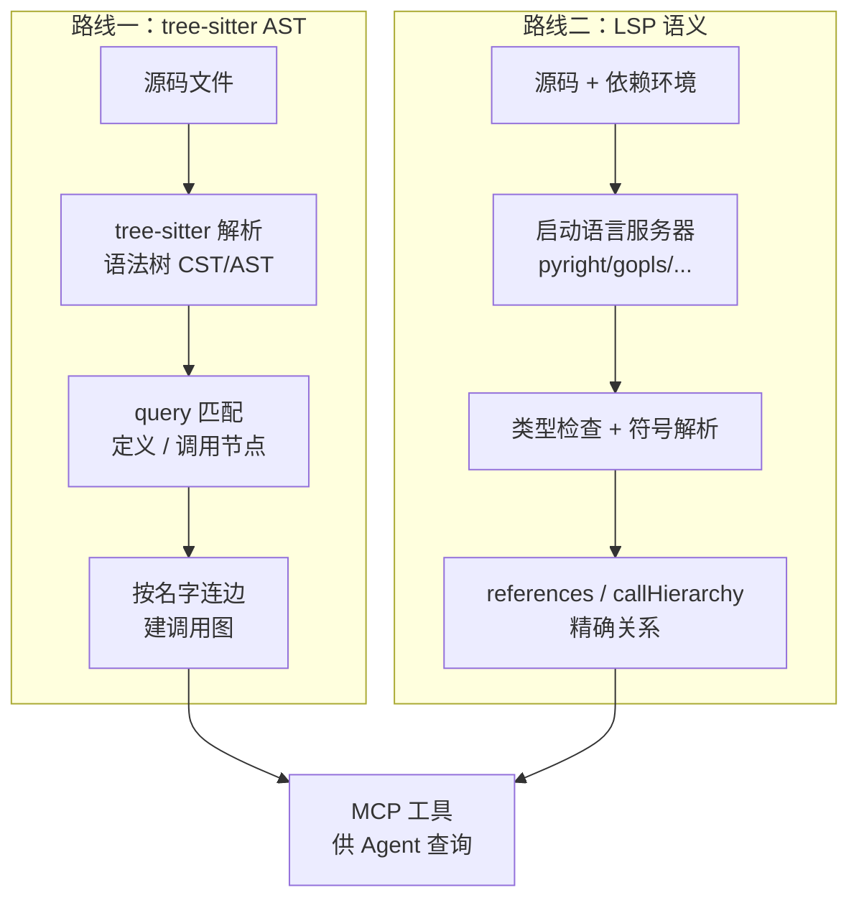
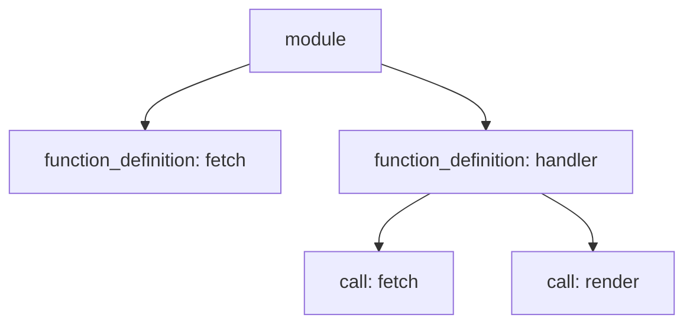

我最近连着刷到好几个「代码知识图谱 MCP」：codegraph、codebase-memory-mcp、GitNexus、Serena……宣传口径都差不多——把代码库建成图谱，让 coding agent 通过 MCP 直接查「谁调用了谁」，少 grep、少 read、省 token、定位更准。

前半句我信，后半句我先打个问号。少读源码这件事，图确实能帮上忙；但「省下的上下文」和「定位更准」是两回事，读到的一组实测也支持这个怀疑（数据在文末，不是我亲手跑的）。所以在我看来，这类工具现在更像一个上下文压缩工具，而不是让 Agent 变聪明的按钮。

工具本身水不水是另一个话题（这一簇 AST 图谱工具有 single-repo 刷 star 的嫌疑，本文不展开）。我更想讲清楚它们底下的两条技术路线，因为图从哪来，直接决定了它给你的是真的语义关系，还是一批看着像关系的名字匹配：一条用 tree-sitter 做语法级 AST 调用图，一条驱动 LSP 语言服务器做语义级分析。

---

## 一个共同的问题：Agent 怎么"看懂"一个陌生大仓

给 coding agent 扔一个百万行的陌生仓库，让它定位「这个 bug 涉及哪些文件、哪个函数」，它默认的招数就是 `grep` + `read`：搜关键词、把命中的文件整段读进上下文，再顺藤摸瓜。这套能用，但两个毛病很明显：

- **费 token**：为了找一个函数的调用方，可能要 read 十几个文件，绝大部分内容跟问题无关。
- **看不到结构**：grep 是文本匹配，它不知道 `handler` 调用了 `fetch`、`fetch` 又实现了某个接口。跨文件的调用关系全靠模型自己在脑子里拼。

「代码知识图谱」想解决的就是这件事：预先把代码的结构关系抽出来存成图，Agent 要什么关系直接查图，而不是把源码整段塞进上下文。节点是函数 / 类 / 文件，边是调用 / 引用 / 继承 / 导入。

问题在于——**这张图从哪来、准不准？** 这就分出了两条路。



差别就在这里：tree-sitter 只看代码"长什么样"（语法），LSP 去理解代码"是什么意思"（语义）。

---

## 路线一：tree-sitter AST 调用图

### 原理

[tree-sitter](https://tree-sitter.github.io/) 是一个增量解析库，最初为 Atom 编辑器做语法高亮，现在几乎是所有需要"轻量解析代码"场景的事实标准（GitHub 代码导航、Neovim 高亮都用它）。它的几个关键特性正好对上建图的需求：

- **语言无关**：每种语言写一份 grammar（`tree-sitter-python`、`tree-sitter-go`……），解析器逻辑复用。想支持新语言，挂个 grammar 就行。
- **快且增量**：改一行只重解析受影响的子树，毫秒级。
- **容错**：语法有错也能解析出局部正确的树——这点很重要，意味着**它不需要代码能编译、也不需要装依赖**。

建图的流程就是解析成语法树后，用 query（S-表达式写的模式）去匹配感兴趣的节点：函数定义在哪、调用发生在哪。tree-sitter 的 query 长这样：

```scheme
; 匹配所有函数定义，捕获函数名
(function_definition
  name: (identifier) @func.name)

; 匹配所有函数调用，捕获被调用的名字
(call
  function: (identifier) @call.name)
```

拿到"定义"和"调用"两组节点后，按位置包含关系把它们连起来：某个 `call` 节点落在某个 `function_definition` 的 body 里，就连一条 `A --调用--> B` 的边。

### Demo

用 Python 的 `py-tree-sitter` 跑一遍，直观感受"从源码到调用边"：

```python
from tree_sitter import Language, Parser, Query
import tree_sitter_python as tspython

parser = Parser(Language(tspython.language()))

source = b"""
def fetch(url):
    return http_get(url)

def handler(req):
    data = fetch(req.url)      # handler -> fetch
    return render(data)        # handler -> render
"""

tree = parser.parse(source)
```

解析出来的语法树（简化）大致是：



然后遍历树，对每个函数收集它 body 内的调用名，连边：

```python
# 伪代码：对每个 function_definition 节点
for func in function_defs:
    caller = func.child_by_field_name("name").text.decode()
    for call in find_calls_within(func.body):
        callee = call.child_by_field_name("function").text.decode()
        graph.add_edge(caller, callee)   # caller --calls--> callee

# 得到：
#   handler -> fetch
#   handler -> render
#   fetch   -> http_get
```

一张调用图就出来了。存进 SQLite 或 Neo4j，再包一层 MCP 工具（`who_calls(fn)`、`callees_of(fn)`、`definition_of(sym)`），Agent 就能直接查关系，不用 read 整个文件。

### 它的软肋：语法 ≠ 语义

问题出在最后"按名字连边"这一步。tree-sitter 看到 `fetch(...)`，只知道这里调用了一个叫 `fetch` 的东西，不知道这个 `fetch` 到底是哪一个。于是遇到下面几种情况就会连错或连不上：

- **同名歧义**：两个模块各有一个 `save()`，`self.save()` 到底指哪个？纯名字匹配分不清。
- **动态派发 / 多态**：`handler.process()`，`handler` 运行时是哪个子类的实例？静态解析看不到。
- **高阶函数 / 回调**：`callbacks.append(fetch)` 再 `cb()`，调用边彻底断掉。
- **反射 / 元编程**：`getattr(obj, name)()`、Python 装饰器、JS 的动态 `require`——无解。
- **跨语言调用**：前端 `fetch('/api/x')` 打到后端某个路由 handler，这条边跨语言，AST 图看不见。

所以 AST 调用图说到底是一张"名字层面"的近似图：召回不错、结构大致对，但精度有天花板，边可能多连（连错），也可能少连（连不上）。它换来的是快、纯本地、零依赖、省 token，代价是你得接受它不那么准。

---

## 路线二：LSP 语义分析

### 原理

LSP（Language Server Protocol）是微软为 VS Code 搞出来的协议，把"编辑器"和"语言智能"解耦：编辑器只管 UI，真正懂代码的是独立进程 **language server**——Python 的 pyright、Go 的 gopls、Rust 的 rust-analyzer、C/C++ 的 clangd、TS 的 tsserver……

关键区别在于，语言服务器做的是完整的语义分析：它解析、做类型检查、建符号表、按作用域和类型解析每一个引用。你在 IDE 里"跳转定义""查找所有引用""重命名"之所以精确，就是它在背后干活。

LSP 路线（Serena 是代表）不自己造轮子，而是把真正的语言服务器当后端跑起来，通过 JSON-RPC 调它的标准方法：

| LSP 方法 | 作用 |
|-|-|
| `textDocument/definition` | 跳转到定义 |
| `textDocument/references` | 查找所有引用（精确到符号，不是名字） |
| `textDocument/documentSymbol` | 单文件符号大纲 |
| `workspace/symbol` | 全工程符号搜索 |
| `callHierarchy/incomingCalls` | 谁调用了我（精确调用图） |
| `callHierarchy/outgoingCalls` | 我调用了谁 |
| `textDocument/hover` | 类型 / 签名 / 文档 |

Serena 把这些包成 MCP 工具（`find_symbol`、`find_referencing_symbols`、`get_symbols_overview`……），Agent 拿到的就是语义级、消歧过的关系，甚至能做符号级的精确编辑（重命名、替换函数体）。

### Demo

LSP 走 JSON-RPC。启动服务器、`initialize` 握手、`didOpen` 打开文件之后，"查找所有引用"是这样一次往返：

```jsonc
// → 请求：谁引用了 service.py 第 2 行第 4 列的这个符号
{ "jsonrpc": "2.0", "id": 1, "method": "textDocument/references",
  "params": {
    "textDocument": { "uri": "file:///app/service.py" },
    "position": { "line": 2, "character": 4 },
    "context": { "includeDeclaration": false }
  }
}
```

```jsonc
// ← 响应：精确的引用位置，跨文件、已消歧
{ "jsonrpc": "2.0", "id": 1, "result": [
    { "uri": "file:///app/handler.py",
      "range": { "start": {"line": 9,  "character": 11}, "end": {"line": 9, "character": 16} } },
    { "uri": "file:///app/worker.py",
      "range": { "start": {"line": 41, "character": 8},  "end": {"line": 41,"character": 13} } }
  ]
}
```

注意请求里传的是坐标（行、列），不是名字。服务器先把光标处解析成一个确切的符号，再返回这个符号的所有引用——哪怕工程里有五个同名函数，它也只给你指的那一个。调用图同理，走 `callHierarchy` 拿到的是解析过类型的入边 / 出边。

### 它的代价

精确不是白来的：

- **要能"跑起来"**：语言服务器需要一个可索引的工程，最好依赖都装好——它得解析 import、找到第三方库的类型才能准。代码跑不起来 / 环境脏，精度就打折甚至挂掉。
- **启动 + 索引慢**：大仓首次索引几十秒到几分钟，内存吃得也多（rust-analyzer 啃大工程能上 GB）。
- **一种语言一个 server**：多语言仓库要同时管好几个服务器进程。
- **有状态、协议啰嗦**：`initialize` → `initialized` → `didOpen` → 等索引完 → 才能查，是一套有状态的长连接，比"解析完就完事"的 tree-sitter 重得多。
- **没有对外暴露的"整张图"**：语言服务器内部确实持有全工程的语义模型（符号表、类型、索引），全局调用关系它是"知道"的——这点别误解。但 LSP 协议没有"把整张调用图导出来"这么一个方法，你只能从某个符号出发、用 `callHierarchy`（`prepareCallHierarchy` → `incomingCalls`/`outgoingCalls`）一层层查，自己 BFS 展开，而且多是按需现算。想要一张能离线存储、随便查的全图，得自己爬一遍拼出来——不像 AST 那样一遍扫完就落成静态图。

---

## 两条路，一张表

| 维度 | tree-sitter AST | LSP 语义 |
|-|-|-|
| 分析层次 | 语法（长什么样） | 语义（是什么意思） |
| 关系精度 | 名字近似，有歧义 | 类型解析，精确消歧 |
| 跨文件 / 多态 / 反射 | 容易断 / 连错 | 能正确解析 |
| 速度 | 毫秒级、增量 | 启动 + 索引慢 |
| 资源占用 | 轻 | 重（内存、进程） |
| 环境依赖 | 无需编译 / 装依赖 | 最好依赖齐全、能索引 |
| 多语言 | 挂 grammar 即可 | 一种语言一个 server |
| 能否精确编辑 | 否（只读结构） | 能（符号级重构） |
| 破损 / 半截代码 | 容错，照样解析 | 容易失效 |
| 适合 | 快速全局导航、省 token、CI 里跑 | 精确引用 / 重构、可信定位 |

选型跟着成本结构走，而不是"谁更先进"：要快、要省、要能在装不齐依赖的仓库上跑，tree-sitter 更稳；要精确引用、要重构级改动、环境也干净，LSP 更可信。现实里还有混合派——先用 tree-sitter 快速圈定范围，再把 LSP 拉起来在小范围里精确解析，速度和精度各拿一半。

---

## 读到的一组实测：省了 token，没更准

光讲原理不够。最近读到别人分享的一组实测，正好戳中这个问题——先说明这不是我亲手跑的，是转述，具体数字以原始来源为准。场景是代码定位（localization）：给一个 issue，让模型找出该改哪些文件 / 函数，偏静态、不改代码，正好是 code graph 最该发力的地方。对照常规的 grep + read，用的是 tree-sitter 这一路的 code graph 工具集，模型是 Claude Sonnet 4.6，在 LocBench 系列上跑。

三档 benchmark 跑下来：

- **LocBench、LocBench-MTLG**：接上 code graph 后，定位准确率跟不接**基本持平**。
- **LocBench-Pro**（更难的那档）：接上 code graph 反而**掉点**。
- **平均输入 token**：降到原来的 **约 2/3**——省了差不多三分之一。

也就是说，在这组实测里，code graph 更确定的收益是省 token，而不是让模型定位得更准；到了更难的 Pro 档，压缩上下文的负作用甚至盖过了它带来的结构信息。

几点推测：

1. **省 token ≠ 提升能力。** code graph 把"读一堆源码"换成"查几条结构关系"，输入自然瘦下来。但如果任务的瓶颈本来就不在"上下文放不放得下"，而在"模型推理得对不对"，那压缩上下文帮不上忙。
2. **AST 图的精度天花板会反噬。** 前面说过 tree-sitter 的图是名字近似——遇到多态、动态派发、跨文件就可能连错或漏连。简单任务（LocBench / MTLG）里图基本够用；到了 Pro 这种更绕的 case，一条连错的边就可能直接把模型带到错误文件里，而原本 grep + 全文能提供的模糊线索反倒被"结构化"掉了。有损压缩在难题上是要还债的。
3. **工具适配性。** 这套 code graph 是新定义的一组 MCP 工具，Sonnet 4.6 未必"熟"——什么时候该查图、查完怎么用，模型的训练分布里见得少，用不顺手也会吃掉一部分本该有的收益。换个对这套工具更适配的模型，结论可能不一样。

所以对"装个知识图谱 MCP 就能让 Agent 更聪明"这类宣传，我的态度是：**它更像一个 token 效率优化，而不是能力升级。** 在"上下文塞不下"确实是瓶颈的大仓场景里，省 1/3 输入是实打实的价值；但别指望它顺带把定位准确率也拉上去——尤其是走 tree-sitter 这条有损的路时，难任务上很可能是负收益。

---

## 最后

两条路谈不上谁更高级，更像两种成本结构。tree-sitter 把成本压到最低——快、纯本地、依赖没装齐也能扫出一棵树，代价是它连的边只到名字这一层，多态、跨文件、反射都可能连错。LSP 反过来，慢、重、挑环境，但只要语言服务器把项目索引起来，光标下那个 `save` 到底是哪一个，它比纯 AST 扫描清楚得多。我最近刷到的那批工具（codegraph、codebase-memory、GitNexus）多数走前一条；Serena 是后一条的代表。

如果你就是想给 Agent 省 token、在大仓里少读点文件，tree-sitter 图有实在价值；这套东西没什么黑魔法，自己撸个精简自用版也不难，精度可控，license 和信任问题都绕开。但别指望它顺带把定位准确率也拉上去——读到的那组实测里，省了约三分之一输入，准确率却只是持平，难档还掉点。

所以我现在把代码图谱放在"省 token 的工具箱"里，而不是"能力增强"那一栏。真要继续验证，我更想看 LSP 路线和真实编辑任务：定位只是第一步，改对才是更难的那步。

> 文末这组实测是转述，不是我亲手跑的，样本和模型都有限，具体数字以原始来源为准。等以后自己跑一轮，再回来补一手数据。
