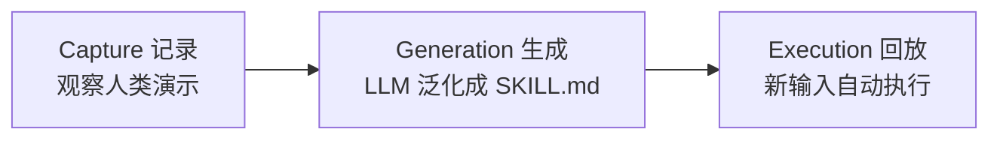

> **这是一篇调研草稿**。功能 2026-06-18 才上线，本文基于官方文档与公开报道梳理实现原理，其中「从录屏到操作序列」一段是结合权限要求做的推断。等作者实际录几个 skill 跑过之后，再补一手体验和踩坑。

Record & Replay 的做法是：你像教同事一样，对着屏幕把一件事演示一遍，Codex 把这段演示泛化成一份用自然语言写的 skill，下次换一组输入，它自己跑完。关键在最后半句——它不记坐标，记的是意图。这也是它和传统宏录制拉开距离的地方。

## 它到底是什么

2026-06-18 随 Codex macOS 应用 v26.616 上线，面向 ChatGPT Plus / Pro / Business / Enterprise / Edu 用户（EEA、英国、瑞士暂不可用）。

往回看，这是个老范式的新实现。Programming by demonstration（按演示编程，PbD）早在 1980 年代中期就有研究：让用户演示一遍操作，系统据此合成一段可复用程序。想法很好，但几十年没真正普及，卡点一直在同一处——从一次具体演示泛化出可复用的程序，太脆弱。你演示「把 A 文件拖到 B 文件夹」，系统很难知道你是想搬这一个文件，还是所有 `.csv`，还是只搬今天改过的。规则引擎硬编码这种泛化，换个场景就崩。

Codex 这次的赌注是：把泛化这一步交给语言模型来做。

## 三段式 pipeline



### 1. Capture：记录一次演示

在 Codex 的 Plugins 面板点 "Record a skill" 开始。macOS 上要授予两个系统权限：Screen Recording 和 Accessibility。录制期间 Codex 观察你的操作和窗口内容，你只管把活儿正常干一遍。

### 2. Generation：从演示泛化成 skill

这是它和传统 RPA / 宏录制真正分道的地方。

老式宏录制记的是像素坐标和固定的点击序列——窗口挪一下、按钮换个位置、列表多一行，整段就崩。Codex 把记录下来的序列喂给语言模型，让模型泛化出一份自然语言写的 `SKILL.md`：什么时候该用这个 skill、需要哪些输入、分几步做、怎么验证做完了。记的是意图，不是坐标。

那「怎么从录屏得到可泛化的操作序列」？官方文档这里写得相当含糊，只说 observes the actions and window content，没展开。

<!-- TODO: 实测后补充——下面这段是推断，需要验证 -->

结合它强制要 Screen Recording + Accessibility 两个权限，可以推断它大概同时拿了三路信号：

| 信号源 | 来自 | 提供什么 |
| --- | --- | --- |
| Accessibility tree | Accessibility 权限 | UI 元素的语义（这是个「上传」按钮，不是「屏幕 (820, 340) 处一块像素」） |
| 输入事件 | Accessibility 权限 | 点击 / 键入 / 选择这类动作序列 |
| 窗口内容截屏 | Screen Recording 权限 | 视觉上下文，补 Accessibility tree 拿不到的信息 |

把这三路对齐后交给 LLM，模型才能写出「点击上传按钮」而不是「点击坐标 (820, 340)」。**这段是推断，等实测确认。**

### 3. Execution：用新输入回放

下次带一组新输入调用这个 skill，不用再给详细指令，Codex 自动跑完整个流程。

它学到的不只是机械步骤，还有你的偏好和习惯。比如你演示发视频时一直把可见性设成 Private 或 Unlisted，这个默认选择会被写进 skill，回放时沿用。

## SKILL.md 长什么样

产物遵循 Open Agent Skills 标准（[agentskills.io](https://agentskills.io)）。一个 skill 就是一个目录，核心是 `SKILL.md`：

- YAML frontmatter 必填 `name` 和 `description`；
- 下面是 markdown 正文（步骤说明）；
- 可选的 `scripts/`、`references/`、`assets/` 子目录；
- 可选的 `agents/openai.yaml`，配置展示名、图标、是否允许隐式触发（`allow_implicit_invocation`）、依赖的工具（如某个 MCP server）。

`description` 要把关键触发词前置，因为 Codex 靠它做隐式匹配——描述写得准，模型才知道什么场景该自动调这个 skill。

下面是一个「上传视频到 YouTube」skill 的示意（正文是我按标准复原的，官方文档没给完整 body 样例）：

```markdown
---
name: upload-video-to-youtube
description: Upload a local video file to YouTube, set title/description, and publish. Use when the user wants to post, publish, or upload a video to YouTube.
---

# Upload video to YouTube

## Inputs
- `video_path`：本地视频文件路径（必填）
- `title`：视频标题（必填）
- `description`：视频简介（可选）
- `visibility`：Public / Unlisted / Private（可选）

## Steps
1. 打开 YouTube Studio，进入 Upload 页面。
2. 选择 `video_path` 指定的文件并等待上传完成。
3. 填入 `title` 和 `description`。
4. 设置可见性：拿不到 `visibility` 时，默认选 **Unlisted**（用户惯例）。
5. 提交发布。

## Verify
- 上传进度显示 100% 且出现视频链接，即视为完成。
- 在频道列表中能看到该视频，可见性与设置一致。
```

注意第 4 步那句「默认选 Unlisted（用户惯例）」——这正是「学到用户偏好」落到产物里的样子。

## 可移植性：没有厂商锁定

产物是纯 Markdown，符合开放标准。这意味着你录出来的 skill 可以直接放进 `.claude/skills/` 给 Claude Code 用，不绑死在 Codex 上。唯一的厂商特定部分是可选的 `agents/openai.yaml` 元数据，不影响 skill 主体的可移植性。

<!-- TODO: 实测后补充——验证录出来的 SKILL.md 直接丢进 .claude/skills/ 能不能被 Claude Code 识别并触发 -->

## 用之前要知道的约束

- **必须开启 Computer Use**。企业侧通过 `requirements.toml` 的 `[features].computer_use` 控制，设成 `false` 这功能就不可用。
- **初始 skills 列表被限制在上下文约 2%**（约 8000 字符）以省 prompt 空间。skill 多了之后这个预算怎么分配、超了会怎样，待实测。

<!-- TODO: 实测后补充——8000 字符预算下，skill 多了之后的实际表现 -->

## 适合 / 不适合什么场景

| 适合无人值守 | 还不适合 |
| --- | --- |
| 重复、边界清晰 | 界面频繁变动 |
| 跑在稳定界面上 | 需要错误处理 / 异常分支 |
| 例：报销、定期导数据、按固定流程发视频 | 需要临场判断的任务 |

简单说：流程越固定、界面越稳，越适合交给它；越需要随机应变，越得人盯着。

## 一个容易混淆的点：两种 "record and replay"

这个词在不同语境里指两件事，别搞混：

1. **本次上线的功能**：演示一段 UI 工作流，把它教成一个 skill（PbD 谱系，目的是自动化复用）。
2. **Session replay**：开发者工具语境里，把保存的一次 agent 运行重新跑一遍，用来复现 / 审计。

本文讲的是第一种。

## 和 gamecraft-bench「轨迹回放」的对照

调研过程中我一直拿它和 gamecraft-bench 的轨迹回放对照——两者都叫「回放」，谱系和目的却几乎相反：

| 维度 | Codex Record & Replay | gamecraft-bench 轨迹回放 |
| --- | --- | --- |
| 记录的是什么 | 为教 agent 而做的人类 UI 演示 | 对游戏的输入轨迹 |
| 是否泛化 | LLM 抽意图、生成 SKILL.md | 不泛化，原样忠实回放 |
| 回放目的 | 用新输入重新执行（自动化复用） | 用相同输入复现以验证打分 |
| 谱系 | programming by demonstration | QA / 测试的 input recording |

所以前者把 trajectory 当成可复用的技能，后者把它当成可验证的证据。

关于 gamecraft-bench 的轨迹回放机制，我另写了一篇拆解，这里不展开。

## 参考

- [Codex Record and Replay（官方文档）](https://developers.openai.com/codex/record-and-replay)
- [Codex Skills（官方文档）](https://developers.openai.com/codex/skills)
- [OpenAI Codex Record & Replay（Times of AI）](https://www.timesofai.com/news/openai-codex-record-replay/)
- [Codex Record and Replay, explained（eesel.ai）](https://www.eesel.ai/blog/codex-record-and-replay-explained)
