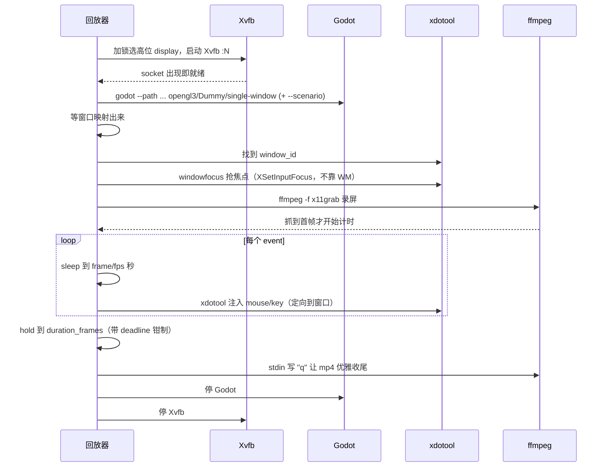
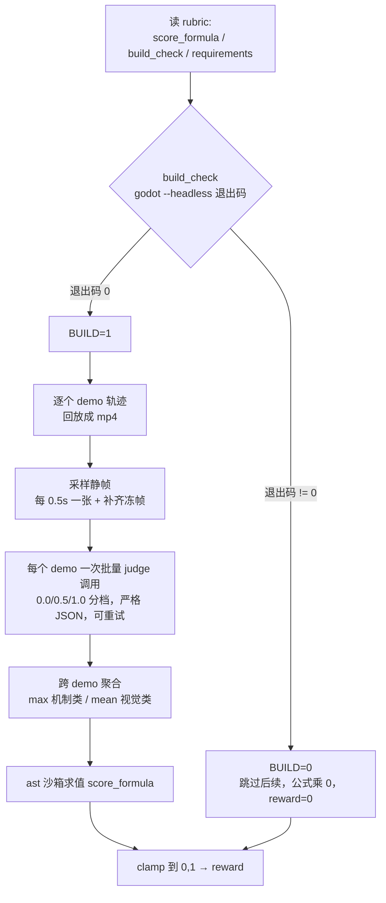

本文基于 `tongxuluo/gamecraft-bench` 的源码（论文 [arXiv:2606.17861](https://arxiv.org/abs/2606.17861)），讲清"轨迹回放 + 多模态评分"这条链路是怎么设计的。

---

## 一、它是什么

GameCraft-Bench 测的是：coding agent 能不能把一段自然语言游戏规格，变成一个**完整可玩的 Godot 项目**。140 个任务，覆盖 15 个游戏门类（平台跳跃、策略、塔防、Roguelike、视觉小说……），跑在 [Harbor](https://github.com/harbor-framework/harbor) 框架上，并自带一个 Docker-less 的本地子进程环境。

它把自己的设计收敛成三条准则（desiderata）：

| 准则 | 含义 |
|---|---|
| Engine Grounding | 游戏在真实游戏引擎（Godot）和运行时里生成、评测，不是抽象代码题 |
| Artifact Completeness | 必须交付完整可启动的项目，而不是零散脚本/场景/素材 |
| Interactive Verification | 用"回放 demo 时观察到的行为"判分，而非检查源码 |

第三条是整套评分哲学的根。它直接决定了后面 rubric 里几乎每一句话都在描述"玩家看到了什么"，而不是"代码里有没有 `_die()`"。

主结果也说明问题——前沿 agent 离"可靠地端到端造游戏"还很远：

| Harness | Model | Overall | Mechanics | Depth | Visuals | Art |
|---|---|---:|---:|---:|---:|---:|
| Claude Code | Opus-4.7 high | **41.46** | 55.34 | 39.48 | 42.78 | 36.86 |
| Codex | GPT-5.5 high | 39.49 | 54.36 | 38.61 | 41.84 | 32.94 |
| Kimi Code | Kimi-K2.6 | 30.65 | 39.76 | 28.07 | 33.66 | 27.99 |
| Codex | DeepSeek-V4-Pro | 2.15 | 2.25 | 1.69 | 1.97 | 2.63 |

最高也就 41.46%。DeepSeek-V4-Pro 那行只有 2.15 分尤其显眼——四个子分全部塌到 2 左右，几乎可以断定是 build gate 没过：项目压根没能用 `godot --headless` 启动起来，后面整条评分链路被乘上 `BUILD=0` 直接清零（这个机制下面会讲）。

Mechanics / Depth / Visuals / Art 这四个子分，正好对应 rubric 里的四个类别：Core Mechanics、Content Depth、Functional Visuals、Art and Presentation。

---

## 二、input traces 从哪来：Agent 自己写出来的

这是整个 benchmark 最反直觉的一点。

直觉上，"回放"意味着先有人玩一遍录下来。但 GameCraft-Bench 的轨迹**不是录真人玩、也不是 verifier 自动探索出来的**——是 agent 解题时自己手写出来的。一次合法提交包含两部分：`/workspace/game` 下的 Godot 项目，外加 `/workspace/game/demo_outputs/` 下的 **1 到 10 个 JSON 轨迹文件**。

任务说明里把这件事讲得很白：

> Ship **1-10 input-trace files** under `/workspace/game/demo_outputs/`, one per demo... The evaluator launches a fresh game per trace, replays your trace as synthetic mouse and keyboard input at 1280x720, and records the screen.

### 轨迹文件格式

一条轨迹就是一个 JSON：声明用哪个场景、录多少帧、以及一串按帧排好的输入事件。

```json
{
  "scenario": "title_flow",
  "duration_frames": 360,
  "events": [
    {"frame": 30,  "type": "mouse_click", "button": "left", "x": 300, "y": 360},
    {"frame": 90,  "type": "key_press",   "keycode": "1"},
    {"frame": 180, "type": "key_press",   "keycode": "SPACE"},
    {"frame": 300, "type": "wait"}
  ]
}
```

- `scenario`：可选。给了就跳菜单、直达某个命名状态；不给就从标题画面正常启动。
- `duration_frames`：按 30fps 录制的总帧数，上限 600 帧（20 秒）。
- `events`：时间有序的输入，坐标是 1280×720 视口里的像素。支持鼠标点击 / 按下 / 抬起 / 移动、按键的按下 / 抬起 / 单击，以及 `wait`（只占一个锚点帧、不产生输入）。拖拽就用「按下 + 若干移动 + 抬起」拼出来。

值得注意的是 keycode 不是任意字符，而是一份白名单：`A`-`Z`、`0`-`9`、`ESCAPE`/`ENTER`/`SPACE`/`TAB`/`BACKSPACE`/`DELETE`/`SHIFT`/`CTRL`/`ALT` 加四个方向键。代码注释写明了用意：

> This is intentionally not a text-entry surface: traces should describe gameplay inputs, not arbitrary typing.

也就是说，轨迹只能描述**游戏操作**，不能拿来当任意文本输入面——这既是语义约束，也堵掉了一类注入风险。

### scenario：为确定性服务

`scenario` 是确定性回放的关键。规则是：正常游玩从标题画面开始；但凡需要特定状态（某一关、战斗中、升级界面、结算画面），就定义命名 scenario，启动时带 `-- --scenario <id>` 跳进去。游戏代码读到这个参数后必须**跳过菜单、确定性地布好状态、seed 掉所有 RNG，然后立刻开始接收输入**。

游戏端用 Godot 的 `OS.get_cmdline_user_args()` 解析这个参数，命中某个 scenario 就直接把状态机切到对应画面：

```gdscript
func _ready() -> void:
    var args := OS.get_cmdline_user_args()
    for i in range(args.size()):
        if args[i] == "--scenario" and i + 1 < args.size():
            scenario = args[i + 1]
    if scenario == "level_select":
        state = GS.LEVEL_SELECT
        level_select_panel.visible = true
    elif scenario == "complete":
        state = GS.COMPLETE
        _show_complete(3.5)
```

配套的轨迹则直接声明 `"scenario": "level_select"`，跳过菜单、上来就玩第一关：

```json
{
  "scenario": "level_select",
  "duration_frames": 540,
  "events": [
    {"frame": 30,  "type": "mouse_click", "button": "left", "x": 200, "y": 180},
    {"frame": 60,  "type": "key_down",    "keycode": "RIGHT"},
    {"frame": 90,  "type": "key_press",   "keycode": "SPACE"},
    {"frame": 120, "type": "key_up",      "keycode": "RIGHT"}
  ]
}
```

注意这个心智模型：agent 写下"第 60 帧按住右、第 90 帧跳一下、第 120 帧松开右"时，它必须在脑子里**预演**自己写的物理引擎会把角色推到哪里、跳多高、能不能踩上第二块平台。这跟 Codex 那种 Record & Replay（先操作、再录制回放）方向正好相反——它更像老式 RPA 的"固定输入序列 + 确定性回放"，只不过这里的"录制者"不是人手，而是 agent 自己的世界模型。轨迹错了，不是回放失败，而是角色掉坑里、demo 里啥都没演出来、裁判照实给 0 分。

---

## 三、verifier 怎么回放

回放逻辑集中在 `replay.py`。它刻意做成"进程编排"风格——Xvfb / Godot / ffmpeg / xdotool 全是子进程，代码不直接跟 X11 通信，只负责按顺序把它们拉起来、对齐时序、再收干净。一条轨迹对应一次完整的起停。

### 子进程时序



这条流水线里真正花心思的是几个"看不见的坑"：

**Xvfb 起虚拟显示，且要防并发抢占。** display 号在一个高位段里随机挑。难点是并发：多个 verifier 各有私有 `/tmp`，但 Xvfb 还会在**网络命名空间**里绑一个 abstract socket（`@/tmp/.X11-unix/Xn`），而网络 namespace 没被隔离，所以光看文件系统 socket 会漏判、撞号。它的做法是同时扫文件系统目录**和** `/proc/net/unix` 里以 `@` 开头的 abstract 名，选号还套一层文件锁，把"探测—绑定"串行化，消除竞态。

**启 Godot：软渲染、无声、单窗口。** 启动命令大致是：

```
godot --path <project> \
      --display-driver x11 \
      --rendering-driver opengl3 \   # 软渲染，无 GPU 也能跑
      --audio-driver Dummy \          # 无声卡
      --single-window
      -- --scenario <id>             # 有 scenario 时才追加
```

scenario 放在 `--` 之后，正好落进游戏能读到的 `OS.get_cmdline_user_args()`。

**无窗口管理器，必须手动抢焦点，否则按键全丢。** 这是个很容易踩的坑。Headless 环境里没有窗口管理器，xdotool 在按键事件上加"定向到某窗口"是一种软定向——没有 WM 来 broker 焦点时它会**静默失败**。所以回放器先用 `windowfocus` 主动抢焦点，它底层走 `XSetInputFocus`，不依赖 WM，能让后续的 keydown/keyup 真的落进 Godot 窗口。

**录屏必须等到首帧才开始计时。** 录制分辨率默认缩到 854×480（16:9 480p），为的是让 mp4 小到能直接喂多模态裁判、省掉二次转码。更微妙的是计时起点：回放器会一直读 ffmpeg 日志，**直到看见它真的吐出第一帧才开始走轨迹时钟**。原因是高负载下 ffmpeg 探测/配置可能耗好几秒，如果在它真正开录之前就开始注入输入，前几帧输入就落在了黑屏的启动画面上，轨迹的 frame 0 和录像的 frame 0 对不齐。

**实时时钟驱动事件。** 计时锚点取在录制开始那一刻，然后逐个事件"睡到 `frame/fps` 秒再注入"，所有注入都定向到游戏窗口。`mouse_click` 会把"移动 + 按下 + 抬起"串进一次 xdotool 调用，减少上下文切换。走完所有事件后 hold 到结尾，再给 ffmpeg 写一个 `q` 让它正常 flush、把 mp4 收尾——直接 kill 会留下损坏的容器文件。

### 安全护栏

回放对象是 agent 写的不可信数据，所以有几道硬护栏：

- **硬墙钟（90 秒）**：覆盖整个事件循环 + hold 阶段。轨迹自报的时长和任何帧偏移都被钳到这个上限，一个声称 duration 巨大、或把事件挂在遥远未来帧的畸形轨迹，没法把 verifier 拖死。超时直接判这个 demo 失败、按 0 分处理。
- **keycode 白名单**：前面说过，故意不暴露任意打字面，遇到名单外的键直接报错。
- **确定性**：同一轨迹 + 全新启动 = 同样的结果。这是对 agent 的硬性要求，也是 verifier 能用单次回放当"标准化游戏证据"的前提。

---

## 四、打分链路：六步

回放产出 mp4 只是中间产物。完整打分在 `score.py` 里编排，分六步：



**① build gate。** 第一步就是在 shell 里跑 rubric 写的 `build_check.cmd`，退出码为 0 则 `BUILD=1`，否则 `BUILD=0`。meat-gauntlet 的命令是：

```
godot --headless --path /workspace/game --quit-after 5
```

关键在于：**只有 build 通过才进入回放和打分**。BUILD=0 时直接跳过后面四步——反正最终公式要乘以 `BUILD`、结果必然是 0，跳过纯属省算力。这正解释了 DeepSeek-V4-Pro 那 2.15 分：build 没过的 trial 直接吃 0。

**② 逐轨迹回放。** 按文件名排序取 `demo_outputs/*.json`，超过 10 个就只留前 10 个，每个回放录成 mp4。单个 demo 回放失败只记进错误日志、跳过，不影响其他 demo。

**③ 采样静帧。** 除了整段视频，还每 0.5 秒抽一张 PNG，视频和静帧一起喂裁判（多模态模型对离散关键帧往往看得更准）。这里两个细节：

- 录像超过 20 秒时，不是均匀抽全程，而是**用 demo 名字当随机种子**选出一个 20 秒窗口、只在窗口内抽——保证同项目同轨迹重跑时抽到同一批帧，分数可复现。
- 用 ffmpeg 的 `tpad` 把尾部冻帧克隆补齐，让裁判拿到的帧数恒定、请求形状可预测。如果录像比逻辑时长短（回放断了），冻住的尾帧照样可见，裁判该扣就扣。

**④ 批量裁判。** 每个 demo **一次**调用裁判，把该 demo 的全部 requirements 打包进去（省 token、省延迟）。裁判后端可换——claude / gemini / openai / kimi 走同一个接口。打分协议在 system prompt 里钉死：严格三档，**只回 JSON、不要 prose 不要 markdown**：

> Score every requirement on a 0.0 to 1.0 scale where 0.0 = not demonstrated at all (or contradicted), 0.5 = partially demonstrated / ambiguous, and 1.0 = clearly and unambiguously demonstrated...

响应解析做了 best-effort 容错：剥掉 markdown fence、容忍前后多余文字、缺失的 requirement 填 0.0。调用侧还有有限次重试和退避；最终仍失败则该 demo 全部 requirement 记 0。

**⑤ 跨 demo 聚合。** 同一个 requirement 在多个 demo 里都被打了分，怎么合成一个值？由该条 requirement 的聚合方式决定：

| 聚合 | 用于 | 语义 |
|---|---|---|
| `max` | 机制类（M、D 项） | 一个 demo 演出来就算数，best evidence wins |
| `mean` | 视觉/美术类 | 每个 demo 都是共享证据，不让一个好看的 demo 遮住十个丑的 |

代码注释把这个取舍讲得很直白："one good demo proves the feature works" 对上 "one slick demo shouldn't cover for ten ugly ones"。机制项几乎都用 `max`，美术呈现类则用 `mean`。

**⑥ 沙箱求公式。** 最后把各 requirement 的聚合值和 `BUILD` 塞进变量表，求 `score_formula`。关键是它**不用 `eval`**，而是自己把公式 parse 成语法树后递归求值，只允许数字、变量名、`+ - * / // % **` 和括号、一元正负号；函数调用、属性访问、下标、比较全部拒绝。原因很现实：`score_formula` 是 task 作者写进 rubric 的字符串，属于不可信输入，必须当沙箱处理、防注入。结果最后 clamp 到 `[0, 1]`。

meat-gauntlet 的真实公式是：

```
BUILD * (0.15 * Mechanics(M1..M5 均值)
       + 0.35 * Depth(D1..D5 均值)
       + 0.15 * Visuals(V1..V4 均值)
       + 0.35 * Art(A1..A4 均值))
```

四个分量正好对应 README 结果表的 Mechanics / Depth / Visuals / Art，权重 0.15 / 0.35 / 0.15 / 0.35——Depth 和 Art 各占 35%，是大头。最外层乘 `BUILD`，build 没过就一切归零。

整个过程结束后，每条 requirement 的逐 demo 分、聚合值，以及裁判的原始输出都会落盘成审计文件，方便复盘。

---

## 五、rubric 设计的两个巧思

把 rubric 的 requirement 描述读一遍，会发现两个反"刷分"的设计。

**① 色块封顶 0.5。** 几乎每条机制项的描述末尾都跟着一句几乎一模一样的话，以 M1 为例：

> Score 1 requires the mechanic to be presented in a visually authored context with real sprites or illustrated assets. Score 0.5 at most if the mechanic works but is represented entirely by programmatic shapes, solid-color fills, or default Godot widgets.

翻译过来：逻辑对、但画面只是一堆色块或默认控件，**单项最高只能给 0.5**；想拿满分必须有真实 sprite / 美术。这直接压制了 agent 走"机制全对、画面全是方块"的捷径。oracle 参考实现自己画的就全是 `draw_rect` 色块——它只是用来验证流程能跑通，不是高分实现，按这条 rubric 机制项也只能封到 0.5。

**② 描述全是"玩家看到了什么"。** 通读所有 requirement，没有一条在说"代码里要有某个类/某个函数"。M2 说的是"hazard 接触瞬间杀死玩家、亚秒级无菜单重生"，M3 说的是"重进通关关卡时，最佳记录会以半透明残影回放、严格复现路径和时序"。判据全部落在可观察行为上，呼应第一节的 Interactive Verification——这也是为什么整套链路必须先把游戏跑起来、录下来，而不能静态分析源码：rubric 问的问题，只有运行时画面能回答。

---

## 小结

GameCraft-Bench 把"评测一个交互式游戏"这件本来很主观、难自动化的事，拆成了三段可控管道：

1. **确定性输入**——让 agent 自己手写 frame 级 JSON 轨迹，配 scenario 跳转 + seed RNG，把"玩游戏"变成可复现的固定序列；
2. **进程级回放**——Xvfb + xdotool + ffmpeg 把轨迹按进真实 Godot 运行时录成 mp4，靠防并发抢占、抢焦点、等首帧这些细节抠出可靠性，靠硬墙钟和白名单守住安全；
3. **多模态裁判 + 沙箱公式**——按"观察到的行为"三档打分，max/mean 分类聚合，再用沙箱算 `BUILD × 四类加权`，build 没过直接清零。

最值得记住的反直觉点还是那一条：**录制者是 agent 自己的脑子**。轨迹写得准不准，本身就是对 agent "我造的这个游戏到底怎么玩"理解程度的考验。
