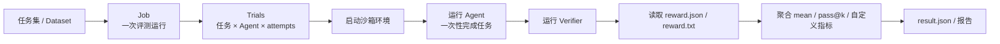
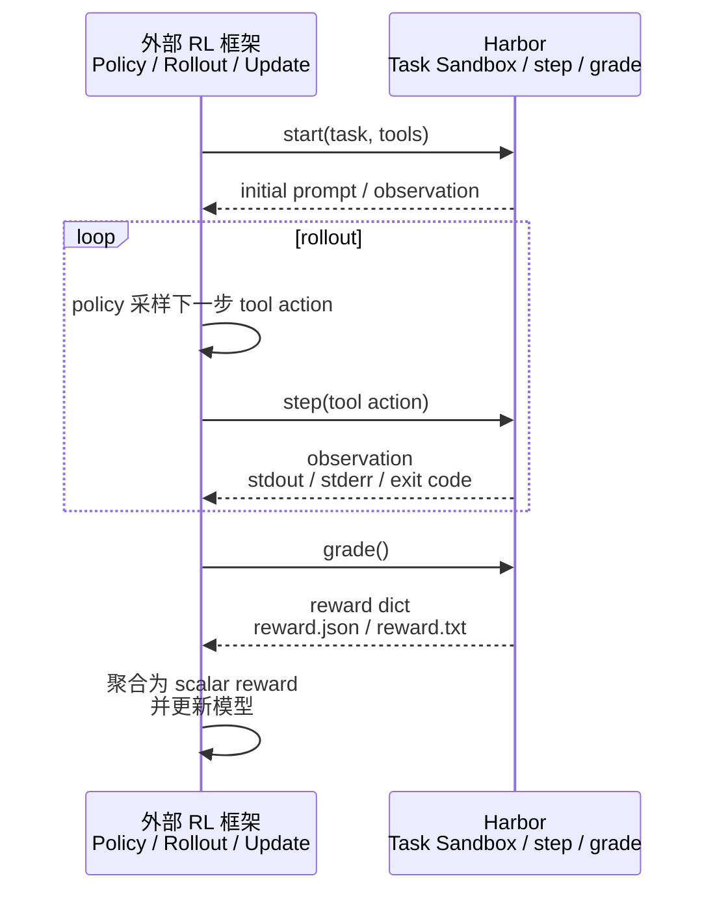

## 写作背景

下午听了一个关于 Harbor 的分享， 正好和手头做的 Eval Harness 的事情相关， 就做一下深入了解， 也许能得到有价值的输入。 目前很多社区工具 or 框架都可以用来做 rollout、 eval 的事，但各自的关注点不同， 比如 SWE-agent， 它更像一个 coding agent scaffold， 专心跑产物； SWE-bench harness 则专注 patch 评测工具； 而本文分析的 Harbor 更像把任务、沙箱、Agent、verifier、reward 和指标聚合串起来的外层执行框架， 该框架由 Terminal-Bench 团队推出，GitHub：[harbor-framework/harbor](https://github.com/harbor-framework/harbor)

这里重点研究三个问题：

- Harbor 在解决什么问题？
- 它和独立 Eval、RL 训练环境是什么关系？
- 它和 SWE-agent 这类工具的抽象层级有什么不同？

---

## 核心结论

Harbor 可以理解成一个面向 Agent 的**真实任务沙箱与评测执行框架**。它不只是跑 benchmark，而是把任务、容器环境、Agent 执行、验证脚本、reward 输出和结果聚合组织成一套统一流程。

本文最重要的三个判断是：

- **Harbor 的主线能力是 Agent Eval**：它适合用来批量评测 Claude Code、Codex、OpenHands 等 CLI Agent 在真实沙箱任务中的表现。
- **Harbor 的关键抽象是 reward 文件契约**：任务验证脚本写出 `reward.json` 或 `reward.txt`，Harbor 统一读取。这让评测结果和 RL reward 可以复用同一套打分逻辑。
- **Harbor 不是完整 RL 训练框架**：它可以作为外部 RL 框架的 environment / rollout executor / reward provider，但模型采样、优势估计、PPO / GRPO、参数更新和 checkpoint 仍由 Tinker、Prime-RL、SkyRL 等外部框架负责。

一句话概括：

```text
Harbor = Agent Eval harness
       + 真实任务 sandbox
       + reward 文件契约
       + RL environment adapter
       - 端到端 RL trainer
```

---

## 为什么需要 Harbor？

评测一个聊天模型相对简单：准备问题，调用模型，拿输出打分。

但评测一个 **coding agent / terminal agent** 就复杂得多。Agent 不只是回答问题，它要在一个真实环境里完成任务：读文件、改代码、运行命令、安装依赖、执行测试，甚至调用外部工具。这个过程会遇到几类工程问题。

### 1. 任务不是一段 prompt，而是一个完整环境

一个真实 Agent 任务通常包含：

- 初始文件系统；
- Dockerfile 或其他环境定义；
- 给 Agent 的 instruction；
- 测试脚本或验证脚本；
- 参考解或 oracle；
- 需要保留的日志、trajectory、artifacts。

如果每个 benchmark 都有自己的任务格式、环境启动方式和测试方式，那么评测框架很难复用。

### 2. Agent 不是一个统一 API，而是一堆 CLI 工具

Claude Code、Codex、OpenHands、Terminus 等 Agent 的调用方式不同，安装方式不同，日志格式不同，token / cost / trajectory 的记录方式也不同。

Harbor 要解决的问题不是“发一个 HTTP 请求给模型”，而是：

```text
把不同 Agent 安装进同一个任务环境
给它们同一份 instruction
让它们在隔离环境中完成任务
最后用同一套 verifier 打分
```

### 3. 打分不能只靠字符串匹配

真实任务的结果往往体现在环境状态里：

- 文件是否被正确修改；
- 服务是否能启动；
- 单元测试是否通过；
- 数据库状态是否符合预期；
- UI 截图是否相似；
- LLM judge 是否认为答案满足要求。

所以 Harbor 的 verifier 不是简单读 Agent 输出，而是在任务环境中运行测试脚本，再把结果写成 reward。

### 4. Eval 与 RL 需要复用同一套环境

Agent 评测关注的是：“这个 Agent 最后完成得怎么样？”

RL 训练关注的是：“模型在多轮行动之后得到多少 reward？如何用这个 reward 更新模型？”

两者执行方式不同，但底层任务环境和打分逻辑高度重合。Harbor 的设计价值就在这里：**同一个 task sandbox 和 verifier 可以服务于独立 Eval，也可以服务于 RL 训练中的 reward 计算。**

---

## Harbor 的核心抽象

Harbor 的系统可以简化成五个部分：

| 抽象 | 解决的问题 | 直观理解 |
|---|---|---|
| Task | 如何描述一个真实任务 | 一个磁盘目录，包含 instruction、环境、测试和配置 |
| Environment | 如何启动和操作沙箱 | Docker 或云沙箱，支持执行命令和传输文件 |
| Agent | 如何接入不同 CLI Agent | 安装、运行、记录过程 |
| Verifier | 如何验证任务结果 | 在环境中跑测试，写出 reward 文件 |
| Metric | 如何聚合多个任务结果 | mean、pass@k、自定义指标等 |

从读者角度，不需要记住每个类和文件名，只需要抓住这条主线：

```text
任务定义 → 启动沙箱 → 运行 Agent → 执行 Verifier → 读取 reward → 聚合结果
```

这条主线也是 Harbor 同时支持 Eval 与 RL 的基础。

---

## 关键创新：reward 文件契约

Harbor 最值得关注的设计是它把“打分结果”抽象成一个文件契约。

Verifier 在沙箱里运行后，需要写出以下两种文件之一：

```text
reward.txt
```

或：

```text
reward.json
```

`reward.txt` 适合单一分数，例如：

```text
1.0
```

Harbor 可以把它理解成：

```json
{"reward": 1.0}
```

`reward.json` 适合多维指标，例如：

```json
{
  "reward": 0.85,
  "unit_tests": 1.0,
  "style": 0.7,
  "security": 0.8
}
```

这个设计有几个好处。

第一，**评测逻辑和框架逻辑解耦**。Harbor 不需要知道某个任务到底如何判断成功，任务作者只要保证 verifier 最后写出 reward 文件。

第二，**打分可以是连续值，也可以是多维指标**。这比简单的 pass / fail 更适合复杂任务。

第三，**Eval 和 RL 可以复用同一套 reward 来源**。Eval 模式下，Harbor 读取 reward 后做指标聚合；RL 模式下，外部 trainer 可以从 reward 字典中取出主 reward，作为模型更新的训练信号。

这个契约是 Harbor 从“评测工具”扩展到“RL environment adapter”的关键桥梁。

---

## 模式一：独立 Agent Eval

这是 Harbor 当前最成熟、最清晰的使用模式。

### Eval 要回答什么问题？

独立 Eval 关注的是：

- 某个 Agent 在一组任务上的成功率如何？
- 不同 Agent / model 在同一任务集上的差异是什么？
- 多次尝试后 pass@k 如何？
- 某个任务是否太简单、太难，或者 verifier 是否可靠？
- 本地 Docker 和云沙箱下的任务结果是否一致？

### Eval 流程



在这个流程里，Harbor 对 Agent 的控制粒度较粗。它给 Agent 一段 instruction，然后让 Agent 自己完成整个任务。Agent 内部可能会进行多轮推理、执行命令、修改文件、运行测试，但 Harbor 不逐步控制每一次 action。

因此，独立 Eval 更像是一个**黑盒式 episode 评测**：

```text
给任务 → Agent 自己做 → 最后统一验证
```

### 为什么这套模式有价值？

它把评测中最麻烦的工程部分标准化了：

- 每个任务都在隔离环境里运行，减少污染；
- 不同 Agent 可以接入同一任务格式；
- 同一套 verifier 可以比较不同 Agent；
- 多 attempt 和 pass@k 可以衡量稳定性；
- 本地和云端沙箱可以在统一接口下切换；
- 失败任务也可以保留日志和结果，方便回溯。

从使用者角度，Harbor 的价值不是“提供一个新指标”，而是提供了一套**可复现、可扩展、可并发的 Agent Eval 执行系统**。

---

## 模式二：与外部 RL 框架协作

RL 模式和 Eval 模式的最大区别是：**RL 需要逐步交互。**

Eval 中，Agent 一次性完成整个任务；RL 中，外部 trainer 需要控制模型一步步行动，收集 observation、action、reward，再用这些数据更新模型。

### RL 训练需要什么？

一个 RL 训练循环通常需要：

- policy / model：当前要训练的模型；
- environment：模型行动的环境；
- action：模型输出的动作；
- observation：环境返回的新状态；
- reward：评价这段行动好坏的分数；
- rollout：一整段交互轨迹；
- trainer：根据 rollout 和 reward 更新模型参数。

在 Agent 任务里，action 往往不是“向左走一步”这种游戏动作，而是工具调用，例如：

```text
运行 bash 命令
读取文件
修改代码
启动测试
查询环境状态
```

### `step()` 是什么？

`step()` 是 RL 环境里的标准概念。它的意思是：

```text
给环境一个 action → 环境执行 action → 返回新的 observation
```

在 Harbor 语境下，可以理解成：

```text
外部 RL 框架生成一个 tool action
    ↓
Harbor 在任务 sandbox 中执行这个 action
    ↓
Harbor 返回 stdout / stderr / exit code / 文件变化等 observation
```

所以 `step()` 不是“训练一步参数更新”，而是“环境向前推进一步”。真正的参数更新发生在外部 RL trainer 里。

### `grade()` 是什么？

`grade()` 负责打分。它复用 Harbor 的 verifier，运行测试脚本，然后读取同一个 reward 文件：

```text
grade()
  → 运行 verifier
  → 读取 reward.json / reward.txt
  → 返回 reward dict
```

外部 RL trainer 通常再从这个 reward dict 中取出一个标量，例如：

```text
reward = rewards["reward"]
```

如果 verifier 输出了多维 reward，也可以自定义聚合：

```text
0.7 × unit_tests + 0.2 × security + 0.1 × style
```

### 外部 RL 框架与 Harbor 的协作关系

这张图是理解 Harbor RL 定位的关键：左边是外部 RL 框架，右边是 Harbor 提供的环境与 reward 能力。



这说明 Harbor 的 RL 定位不是“替你训练模型”，而是：

```text
Harbor 负责让模型在真实任务环境里行动，并给出可复用的 reward。
外部 RL 框架负责根据这些行动和 reward 更新模型。
```

### Eval 与 RL 的共同点和区别

| 维度 | 独立 Eval 模式 | RL 协作模式 |
|---|---|---|
| 目标 | 评测 Agent 表现 | 训练或优化模型 / policy |
| 控制粒度 | Agent 一次性完成任务 | trainer 逐步调用 `step()` |
| Harbor 角色 | eval harness | environment / reward provider |
| reward 来源 | verifier 写 reward 文件 | 同一个 verifier 写 reward 文件 |
| 输出 | 指标、日志、trajectory、result | observation、rollout、reward dict |
| 模型更新 | 无 | 外部 RL 框架负责 |

共同点在于：两种模式都复用 Harbor 的 task、sandbox、verifier 和 reward 文件契约。

区别在于：Eval 关注“测得准”，RL 关注“如何把环境交互和 reward 接给 trainer”。

---

## Harbor 的创新点

从架构角度看，Harbor 的创新不在某个单独算法，而在于把几件原本分散的事情组合成了一个统一系统。

### 1. 任务即环境，而不只是 prompt

很多 LLM eval 只评估输入输出。但 Agent 任务需要完整环境，Harbor 把任务定义成可版本化、可复现的目录结构。这让任务可以像数据集一样管理。

### 2. 沙箱 provider 可替换

Harbor 把“执行命令、传输文件、启动 / 停止环境”抽象成统一能力。无论底层是本地 Docker，还是云端 sandbox，Trial 运行器看到的都是同一类环境接口。

这让 Harbor 可以在本地小规模调试，也可以切到云端扩大并发。

### 3. Agent 接入面向 CLI 现实

现实里的 coding agent 多数不是统一 API，而是各自的 CLI 和运行方式。Harbor 的 Agent 抽象允许把这些 CLI Agent 包装进同一评测流程。

### 4. reward 文件契约连接 Eval 与 RL

这是本文反复强调的关键点。

Eval 和 RL 的执行方式不同，但都需要知道“任务完成得怎么样”。Harbor 用 `reward.json` / `reward.txt` 把打分结果标准化，让同一个 verifier 能服务两种模式。

### 5. Adapter 生态降低 benchmark 接入成本

Harbor 还提供 adapter 思路，把外部 benchmark 转换成统一任务格式。这样不同来源的任务可以进入同一个执行与评测系统。

---

## 和 SWE-agent 的区别

讨论 Harbor 时很容易想到 SWE-agent：SWE-agent 也能 rollout，也能跑 SWE-bench，也有 batch 入口和 trajectory。那么 Harbor 和 SWE-agent 是不是重复？

我的理解是：**它们不在同一抽象层级。**

### SWE-agent 更像一个 coding agent scaffold

SWE-agent 的核心是让模型通过一组工具逐步操作代码仓库。它关注的是：

- 模型看到什么 prompt；
- action 格式如何设计；
- 如何浏览文件、编辑代码、运行命令；
- 如何记录 thought / action / observation trajectory；
- 如何生成 patch；
- 如何把 patch / predictions 接到 SWE-bench evaluation。

所以 SWE-agent 的典型链路是：

```text
GitHub issue / SWE-bench instance
  → SWE-agent rollout
  → thought / action / observation trajectory
  → patch / preds.json
  → SWE-bench harness 或 sb-cli 做最终评测
```

这里的重点是 **Agent 如何行动**。SWE-agent 自己就是一个 Agent 系统，或者说是构建 coding agent 的 scaffold。

### Harbor 更像外层 eval / environment harness

Harbor 关注的是另一组问题：

- 任务如何统一描述；
- 沙箱如何启动和隔离；
- 不同 Agent 如何接入；
- verifier 如何运行；
- reward 如何标准化；
- 多任务、多 Agent、多 attempt 如何并发和聚合；
- 同一套任务与 verifier 如何复用到 RL 环境中。

所以 Harbor 的典型链路是：

```text
Task + Sandbox
  → 运行某个 Agent
  → Verifier 写 reward.json / reward.txt
  → Harbor 聚合 metrics
```

这里的重点是 **如何组织评测环境和 reward 系统**，而不是定义某一个 Agent 应该如何行动。

### Harbor 可以把 SWE-agent 看成一个被评测对象

这是最关键的层级关系。

SWE-agent 可以参加 Harbor 组织的“考试”。在 Harbor 的视角里，SWE-agent 可以和 Claude Code、Codex、OpenHands、Terminus、Oracle、Nop 一样，都是一个待运行、待比较的 Agent。

```text
Harbor
  ├── Agent: SWE-agent
  ├── Agent: Claude Code
  ├── Agent: Codex
  ├── Agent: OpenHands
  ├── Agent: Oracle
  └── Agent: Nop
```

也就是说：

```text
SWE-agent 解决“一个 Agent 怎么行动”
Harbor 解决“很多 Agent 怎么在同一套任务环境里被评测和打分”
```

### 对比总结

| 维度 | SWE-agent | Harbor |
|---|---|---|
| 核心定位 | coding agent / agent scaffold | eval harness + sandbox environment + reward provider |
| 关注中心 | Agent 如何逐步操作仓库 | 任务、环境、Agent、verifier、reward 如何统一编排 |
| rollout | Agent 自己产生 thought/action/observation trajectory | Eval 模式运行外部 Agent；RL 模式可作为 environment step executor |
| eval | 主要围绕 SWE-bench patch evaluation | 通过 verifier + reward 文件契约支持更通用任务 |
| 典型产物 | trajectory、patch、preds.json | reward dict、metrics、result、artifacts |
| RL 关系 | 可产生 trajectory，但不是 RL environment provider 的主定位 | 可作为外部 RL 框架的 environment / reward provider |


---

## 局限与注意事项

1. **RL 能力尚在演进中**：本次调研快照中，`harbor.rl` 相关能力主要出现在特性分支和 cookbook 示例里，不能等同于主线已成熟交付的完整 RL 框架。
2. **Harbor 不是 trainer**：它不负责 PPO / GRPO、参数更新、分布式训练和 checkpoint。它更像外部 RL 框架的环境层与 reward provider。
3. **任务质量仍然决定评测质量**：Harbor 能标准化执行流程，但不能自动保证 verifier 合理、任务无泄漏、reward 设计无偏。
4. **多维 reward 需要选择主目标**：Eval 可以展示多维指标，但 RL trainer 通常需要一个标量 reward。任务作者需要明确 `reward` 主 key，或提供可解释的聚合规则。
5. **云沙箱依赖凭证和额外依赖**：Harbor 可以适配多类环境 provider，但不同 provider 的可用性取决于 SDK、账号、配额和网络条件。
6. **项目迭代活跃**：本文基于 2026-06-05 的源码快照整理，RL 相关结论尤其需要结合后续版本变化重新确认。

---

## 适合怎么用？

### 如果你要做 Agent Eval

Harbor 适合以下场景：

- 你有一批真实终端任务，希望比较多个 Agent；
- 你希望每个任务都在隔离环境中运行；
- 你需要多 attempt、pass@k、失败日志和结果归档；
- 你希望同一套任务可以在本地和云端沙箱之间切换；
- 你希望用 oracle / nop 这类基线检查任务与 verifier 是否可靠。

这时 Harbor 可以作为主评测框架使用。

### 如果你要做 RL 或优化

Harbor 更适合作为外部 RL 框架的环境适配层：

- Harbor 提供 task sandbox；
- Harbor 执行 tool action；
- Harbor 返回 observation；
- Harbor 复用 verifier 产出 reward；
- 外部 RL 框架负责 rollout 调度和模型更新。

如果只是做提示词优化，GEPA 这类方案可以直接把 Harbor trial 的 reward 当作 fitness。
如果要做权重 RL，则需要 Tinker、Prime-RL、SkyRL 等 trainer 接管训练主循环。

---

## 总结

Harbor 的价值不在于提出一种新的 RL 算法，也不在于替代所有 Agent 框架。它真正解决的是一个更底层、更工程化的问题：

> 如何把真实任务、隔离环境、Agent 执行、验证脚本和 reward 输出组织成一套可复用的系统？

在独立 Eval 模式下，它让不同 Agent 可以在同一批真实任务中被公平、可复现地评测。

在 RL 协作模式下，它把同一套任务环境和 verifier 暴露给外部 trainer，让模型可以通过 `step()` 与真实 sandbox 交互，再通过 `grade()` 获得 reward。

因此，Harbor 最合理的定位是：**Agent Eval 的执行框架，以及面向 RL 的任务环境与 reward provider**。它连接了 Eval 和 RL，但不替代外部 RL 框架。

---

## 参考资料

以下资料的检出 / 访问时间为 2026-06-05。

1. [harbor-framework/harbor](https://github.com/harbor-framework/harbor) — Harbor 主仓库，本文关于任务、环境、Agent、Verifier、Metric、Registry 的描述基于该仓库快照整理。
2. [harbor-framework/harbor-cookbook](https://github.com/harbor-framework/harbor-cookbook) — Harbor 端到端配方，以及 RL / optimization 示例。
3. Harbor README / CHANGELOG / registry.json — 用于确认项目定位、版本状态、任务注册方式和生态说明。
4. [Terminal-Bench](https://www.tbench.ai) — Harbor 与 Terminal-Bench benchmark 的关联背景。

---

_写作说明：本文基于 Harbor v0.13.1 与 harbor-cookbook 的本地源码快照整理，重点解释架构和流程。
