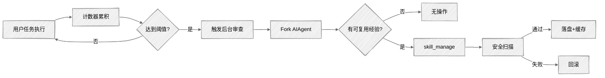

## 一、概述

Hermes Agent 是由 Nous Research 开发的自改进型 AI Agent，其核心差异化能力在于内置了一个**闭环学习系统**——它能够从任务执行经验中自动提取可复用的程序化知识（即 Skill），并在后续会话中调用这些 Skill 来复现成功的工作流。Skill 不是简单的提示词模板，而是包含触发条件、分步指令、陷阱规避和验证步骤的完整 procedure。

本报告从宏观架构、分阶段执行流程和关键源码三个维度，由浅入深地解析这一机制。

---

## 二、技能自动生成机制概览

技能自生成的核心是一条**闭环流水线**：Agent 在执行用户任务的过程中，通过迭代计数器累积工具调用次数，达到阈值后自动触发后台审查线程；审查 Agent fork 自身配置，独立判断是否有可复用的执行经验，进而调用 `skill_manage` 创建或更新技能。

核心组件关系：

```
┌─────────────────────────────────────┐
│        触发器（自生成核心）          │
│     迭代计数器 + 后台审查线程        │
└──────────────┬──────────────────────┘
               │
    ┌──────────┼──────────┐
    ▼          ▼          ▼
┌───────┐  ┌───────┐  ┌───────┐
│skill_ │  │skills_│  │本地存储 │
│manage │  │guard  │  │skills/ │
└───────┘  └───────┘  └───┬───┘
                          │
                          ▼
                    ┌───────────┐
                    │索引 → sp  │
                    └───────────┘
```

- **触发器**：自生成的发动机，通过计数器 + 后台线程驱动整个闭环
- **skill_manage**：审查 Agent 实际写入技能的入口
- **skills_guard**：所有写入必经的安全审查
- **本地存储**：唯一事实来源，技能持久化落盘于此
- **索引 → sp**：扫描本地技能生成索引，注入 system prompt

本文第三节将深入解析触发层的完整流水线与关键源码。关于存储、安全、Skills Hub 等基础设施的详细设计，见第五节"技能系统底座全景"。

---

## 三、分阶段执行流程

技能自生成机制遵循**"执行 → 累积 → 触发 → 审查 → 生成/更新 → 安全确认"**的六阶段流水线：



### Stage 1: 任务执行（Execution）

Agent 进入标准对话循环，调用工具完成用户任务。每次工具调用后，迭代计数器递增。

### Stage 2: 计数累积（Accumulation）

`run_agent.py:9073-9077` 中维护了一个计数器 `_iters_since_skill`，每次工具调用迭代后自增：

```python
# Track tool-calling iterations for skill nudge.
# Counter resets whenever skill_manage is actually used.
if (self._skill_nudge_interval > 0
        and "skill_manage" in self.valid_tool_names):
    self._iters_since_skill += 1
```

当 Agent 主动调用 `skill_manage`（无论是创建还是更新技能）时，计数器立即归零，避免重复触发。

### Stage 3: 触发判断（Trigger）

在每次用户 turn 结束时（`run_agent.py:11887-11893`），系统检查触发条件：

```python
_should_review_skills = False
if (self._skill_nudge_interval > 0
        and self._iters_since_skill >= self._skill_nudge_interval
        and "skill_manage" in self.valid_tool_names):
    _should_review_skills = True
    self._iters_since_skill = 0
```

触发条件：

- `skill_manage` 工具已加载
- 计数器达到 `creation_nudge_interval`（默认 10，可通过 `config.yaml` 调整）
- 当前 turn 没有被中断

### Stage 4: 后台审查（Review）

触发后，系统启动一个**后台线程**（`run_agent.py:2867-2954`），创建一个与主 Agent 配置完全一致的 forked `AIAgent`：

```python
def _spawn_background_review(self, messages_snapshot, review_memory=False, review_skills=False):
    import threading
    def _run_review():
        review_agent = AIAgent(
            model=self.model,
            max_iterations=8,          # 限制审查 agent 的迭代次数
            quiet_mode=True,           # 不输出到终端
            platform=self.platform,
            provider=self.provider,
        )
        review_agent._memory_store = self._memory_store
        review_agent._skill_nudge_interval = 0   # 禁止嵌套审查
        review_agent.run_conversation(
            user_message=prompt,
            conversation_history=messages_snapshot,
        )
    threading.Thread(target=_run_review, daemon=True).start()
```

关键设计决策：

- **后台执行**：审查在独立的 daemon 线程中运行，不阻塞主对话响应
- **共享存储**：审查 Agent 直接写入主 Agent 的 `_memory_store`，实现状态共享
- **迭代限制**：`max_iterations=8` 防止审查过程本身消耗过多 token
- **禁用递归**：审查 Agent 的 `_skill_nudge_interval = 0`，避免无限递归审查

### Stage 5: 技能生成/更新（Generation / Update）

审查 Agent 收到的提示模板（`run_agent.py:2843-2851`）明确了判断标准：

```python
_SKILL_REVIEW_PROMPT = (
    "Review the conversation above and consider saving or updating a skill if appropriate.\n\n"
    "Focus on: was a non-trivial approach used to complete a task that required trial "
    "and error, or changing course due to experiential findings along the way, or did "
    "the user expect or desire a different method or outcome?\n\n"
    "If a relevant skill already exists, update it with what you learned. "
    "Otherwise, create a new skill if the approach is reusable.\n"
    "If nothing is worth saving, just say 'Nothing to save.' and stop."
)
```

审查 Agent 独立判断是否需要创建新技能或更新现有技能，并通过 `skill_manage` 工具执行。

`skill_manage`（`tools/skill_manager_tool.py`）是写入技能的唯一入口，支持 6 种 action。其 **create 流程** 如下：

```python
def _create_skill(name: str, content: str, category: str = None) -> Dict[str, Any]:
    # 1. 校验名称格式
    err = _validate_name(name)
    if err: return {"success": False, "error": err}

    # 2. 校验 frontmatter（必须包含 name 和 description）
    err = _validate_frontmatter(content)
    if err: return {"success": False, "error": err}

    # 3. 校验内容大小（上限 100,000 字符）
    err = _validate_content_size(content)
    if err: return {"success": False, "error": err}

    # 4. 检查名称冲突
    existing = _find_skill(name)
    if existing:
        return {"success": False, "error": f"A skill named '{name}' already exists..."}

    # 5. 原子写入 SKILL.md
    skill_dir = _resolve_skill_dir(name, category)
    skill_dir.mkdir(parents=True, exist_ok=True)
    _atomic_write_text(skill_md, content)

    # 6. 安全扫描 —— 不通过则回滚
    scan_error = _security_scan_skill(skill_dir)
    if scan_error:
        shutil.rmtree(skill_dir, ignore_errors=True)
        return {"success": False, "error": scan_error}

    return {"success": True, "message": f"Skill '{name}' created."}
```

关键设计点：

- **原子写入**：`tempfile.mkstemp + os.replace` 避免半写状态
- **大小限制**：`MAX_SKILL_CONTENT_CHARS = 100_000`（约 36k tokens）
- **Frontmatter 强制**：必须以 YAML frontmatter 开头，包含 `name` 和 `description`
- **patch 更新**：使用模糊匹配引擎（`fuzzy_find_and_replace`），匹配失败时返回文件预览供模型自纠正

### Stage 6: 安全确认（Security Validation）

所有通过 `skill_manage` 的写入操作都会经过 `skills_guard` 扫描（`tools/skill_manager_tool.py:56-74`）：

```python
def _security_scan_skill(skill_dir: Path) -> Optional[str]:
    if not _GUARD_AVAILABLE:
        return None
    result = scan_skill(skill_dir, source="agent-created")
    allowed, reason = should_allow_install(result)
    if allowed is False:
        report = format_scan_report(result)
        return f"Security scan blocked this skill ({reason}):\n{report}"
```

扫描不通过时，系统自动回滚写入（删除目录或恢复备份内容）。

---

## 四、机制设计要点总结

| 设计维度     | 实现策略                                            |
| ------------ | --------------------------------------------------- |
| **触发时机** | 基于工具调用迭代计数器（默认每 10 次），非时间驱动  |
| **审查方式** | 后台 daemon 线程，fork 同配置 AIAgent，不阻塞主响应 |
| **安全模型** | 写入后扫描 + 隔离区 + 审计日志，失败自动回滚        |
| **性能优化** | 双层缓存（进程 LRU + 磁盘快照）+ 渐进式披露         |
| **扩展性**   | 源适配器模式支持任意远程技能市场                    |

---

## 五、技能系统底座全景

前文聚焦技能**自动生成**的闭环流水线，本节从**数据流视角**补充技能在系统中的完整生命周期：从哪里来、怎么进入系统、怎么被使用。

```
来源 ──→ 安装管道 ──→ 本地存储 ──→ 索引构建 ──→ 运行时加载
         (隔离区+安检)           (system prompt)   (/skill 命令)
```

### 5.1 技能来源

技能有两个入口：

- **Agent 自生成**：审查 Agent 调用 `skill_manage` 创建（详见第三章 Stage 5）
- **远程 Skills Hub**：`tools/skills_hub.py` 实现了**源适配器模式**，支持从多个市场下载

| 适配器                    | 源                                     | 信任级别          |
| ------------------------- | -------------------------------------- | ----------------- |
| `OptionalSkillSource`     | 仓库内 `optional-skills/` 目录         | builtin           |
| `HermesIndexSource`       | hermes-agent.nousresearch.com 中央索引 | varies            |
| `GitHubSource`            | GitHub Contents/Trees API              | trusted/community |
| `SkillsShSource`          | skills.sh 市场                         | community         |
| `ClawHubSource`           | clawhub.ai                             | community         |
| `ClaudeMarketplaceSource` | Claude Code marketplace                | community         |
| `LobeHubSource`           | LobeHub agent 市场                     | community         |

用户通过 slash 命令触发下载（如 `/skill install <name>` 或 `/skills-hub search <query>`），`agent/skill_commands.py` 解析命令后调用 `tools/skills_hub.py` 的对应适配器拉取技能包。

无论来自哪个源，**所有技能最终都必须进入本地目录** `~/.hermes/skills/` 才能被 Agent 识别和使用。

### 5.2 安装管道：隔离区与安全扫描

技能进入本地存储前，必须经过统一的安全管道：

```
远程下载 / skill_manage 写入
        │
        ▼
   隔离区（Quarantine）
        │
        ▼
   skills_guard 扫描
        │
   ┌────┴────┐
   ▼         ▼
 通过      失败
   │         │
   ▼         ▼
本地目录   回滚删除
```

`tools/skills_guard.py` 检测 prompt injection、secret exfiltration、code execution 等风险模式。Agent 自生成的技能与社区 Hub 下载的技能接受同等审查，扫描不通过则回滚写入。

```python
def quarantine_bundle(bundle: SkillBundle) -> Path:
    """远程技能先写入隔离目录"""
    dest = QUARANTINE_DIR / skill_name
    # ... 写入文件
    return dest

def install_from_quarantine(quarantine_path, skill_name, category, bundle, scan_result) -> Path:
    """扫描通过后移入 skills 目录"""
    install_dir = SKILLS_DIR / category / skill_name
    shutil.move(str(quarantine_path), str(install_dir))
    lock.record_install(...)   # 记录到 lock.json
```

隔离区是安装管道的**临时缓冲区**，技能不会长期停留于此。它的作用是确保不安全的技能在正式入库前就被拦截。

### 5.3 本地存储

`~/.hermes/skills/` 是**单一事实来源**。即使 Skills Hub 提供了多源下载能力，Agent 运行时只认本地目录中的技能。目录结构：

```
skill-name/
├── SKILL.md           # 主指令文件（必需）
├── references/        # 参考文档
├── templates/         # 输出模板
├── scripts/           # 可执行脚本
└── assets/            # 辅助资源
```

此外可通过 `skills.external_dirs` 配置挂载额外的只读技能库。

### 5.4 技能索引与提示注入

`agent/prompt_builder.py::build_skills_system_prompt()` 扫描本地 skills 目录，解析每个 SKILL.md 的 frontmatter，按类别聚合后生成一段 markdown 技能索引，由上层函数拼接到 system prompt（位于工具描述之后）。

生成的索引格式：

```markdown
## Skills (mandatory)

Before replying, scan the skills below. If a skill matches or is even partially relevant
to your task, you MUST load it with skill_view(name) and follow its instructions.

productivity: - maps: Location intelligence — geocode, reverse-geocode, POI search, routing - linear: Manage Linear issues via GraphQL API
devops: - docker-deploy: Container build and deploy procedures
```

扫描过程中还会按条件过滤：只有声明兼容当前工具集的技能才会进入索引：

```yaml
metadata:
  hermes:
    requires_toolsets: [terminal] # 仅在 terminal 工具集可用时显示
    fallback_for_toolsets: [mcp] # 当 mcp 工具集不可用时作为 fallback 显示
```

为避免每次请求都重复扫描目录，采用**双层缓存**：

1. **进程内 LRU 缓存**：以 `(skills_dir, tools, toolsets, platform, disabled)` 为 key。命中直接返回；未命中则回退到磁盘快照。
2. **磁盘快照**：`.skills_prompt_snapshot.json`，按 mtime/size manifest 校验。进程重启后仍有效；校验失败则重新扫描 skills 目录构建索引，同时更新两层缓存。

缓存失效条件：任一 key 要素变化，或技能文件被修改（mtime/size 变更）。

### 5.5 运行时加载

技能进入对话上下文有两种方式：

**自动识别** —— system prompt 中的索引已包含指令 "If a skill matches... you MUST load it with skill_view(name)"。Agent 每次回复前扫描索引，自行判断并调用 `skill_view` 加载匹配的技能。

**手动触发** —— 用户输入 `/skill-name` 命令，由 `agent/skill_commands.py` 直接加载：

```python
def _build_skill_message(loaded_skill, skill_dir, activation_note, ...):
    content = loaded_skill.get("content", "")

    # 1. 模板变量替换（${HERMES_SKILL_DIR}, ${HERMES_SESSION_ID}）
    content = _substitute_template_vars(content, skill_dir, session_id)

    # 2. 内联 shell 执行（!`date +%Y-%m-%d`）
    content = _expand_inline_shell(content, skill_dir, timeout)

    parts = [activation_note, "", content.strip()]

    # 3. 注入技能目录绝对路径
    if skill_dir:
        parts.append(f"[Skill directory: {skill_dir}]")

    # 4. 注入技能配置值
    _inject_skill_config(loaded_skill, parts)

    # 5. 自动发现 supporting files
    for subdir in ("references", "templates", "scripts", "assets"):
        # ... 收集并列出

    return "\n".join(parts)
```

---

## 六、引用

1. [NousResearch/hermes-agent](https://github.com/NousResearch/hermes-agent) - 主仓库，MIT 协议
2. `run_agent.py` - AIAgent 核心对话循环与后台审查机制
3. `tools/skill_manager_tool.py` - skill_manage 工具实现
4. `tools/skills_hub.py` - Skills Hub 源适配器与安装流程
5. `agent/prompt_builder.py` - 系统提示构建与技能索引缓存
6. `agent/skill_commands.py` - 技能加载与消息注入
7. `agent/skill_utils.py` - 技能元数据解析与平台匹配
8. `tools/skills_tool.py` - skill_view / skills_list 工具实现
