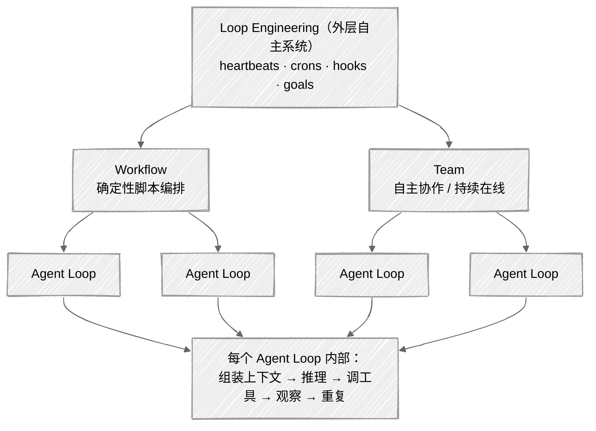

> **一句话定义**：`Workflow` 用脚本确定性地编排一群 agent；`Team` 让一群 agent 自主协作、持续在线；**Loop Engineering** 比这两者高一层——设计「去驱动 agent 的系统」，而不是亲手 prompt 每一个 agent。

---

## 里层与外层

这篇文章源于一个具体需求：把本地一批"评测失败"的前端产物 case 重新跑一遍、并归纳失败原因。串行写个 `for` 循环能做，工具自带的 `--concurrency` 也能并行跑。但一旦任务变成"跑完还得读日志、判断根因、跨样本聚类"，就不再是调一次模型，而是在编排一群模型协作。

把 agent 用起来有里外两层。**里层**是单个 agent 自己的循环：组装上下文 → 推理 → 调工具 → 观察 → 再来一轮，直到收尾。**外层**是怎么驱动一群这样的 agent——派活、收结果、决定下一步。本文讲的是外层。

Claude Code 在外层给了两件工具：`Workflow` 和 `Team`。而 2026 年上半年流行起来的 **Loop Engineering**，正是给这一层起的统称。下面先讲清楚两件工具各自怎么用，再回到 Loop Engineering。

---

## Workflow：用脚本确定性地编排一群 Agent

普通的 `Agent` 工具一次只起一个子 agent。`Workflow` 让你用一段 **JavaScript 脚本**，把几十个子 agent 组织成流水线、并行组、投票团或循环，最后把结果汇总回主对话。

它适合三类场景：

- **要全面**：把任务拆开，多个 agent 并行覆盖（全仓审计、批量迁移）
- **要可信**：多个独立视角 / 对抗性检查互相验证后再下结论
- **规模超出单个上下文**：大迁移、全仓扫描，单个 agent 的上下文窗口装不下

### 核心原语

| 原语 | 作用 |
|---|---|
| `agent(prompt, opts)` | 起一个子 agent；带 `schema`（JSON Schema）就返回**校验过的结构化对象**，省去解析自由文本 |
| `pipeline(items, s1, s2…)` | **默认选择**：每个 item 独立流过各 stage，stage 间无屏障，墙钟时间 = 最慢的单条链 |
| `parallel(thunks)` | 并发跑一批，**有屏障**——等全部完成才返回；失败的变 `null`，记得 `.filter(Boolean)` |
| `log()` / `phase()` | 发进度 / 给进度分组 |

> 💡 一个关键术语澄清：英文里常说的 **fan-out**，本文统一叫**「并行分发」**——指一次把一批任务同时交给多个 agent 跑。这是 Workflow 最常见的形态。

### 一个真实例子：批量重跑 + 归因

设想我们要对一批前端产物 case（每个 case 是一份 HTML 产物 + 评分 rubric）批量重跑评测器，并自动归纳失败模式。脚本骨架如下：

```javascript
export const meta = {
  name: 'run-failed-cases',
  description: '并行重跑一批 case 并汇总失败模式',
  phases: [
    { title: 'Eval', detail: '每个 case 一个 agent：跑 CLI + 解析 result.json' },
    { title: 'Synthesize', detail: '汇总所有判定，归纳失败模式' },
  ],
}

const cases = args  // 主对话传入的 case 路径列表

// 每个 case 的 agent 必须返回这个结构，而非自由文本
const VERDICT = {
  type: 'object',
  required: ['id', 'ok', 'final_score', 'summary'],
  properties: {
    id: { type: 'string' },
    ok: { type: 'boolean' },
    final_score: { type: 'number' },
    failure_reason: { type: 'string' },
    summary: { type: 'string' },
  },
}

phase('Eval')
const results = await parallel(cases.map((dir) => () => {
  const id = dir.split('/').pop()
  return agent(
    `运行：node dist/cli.js run --case ${dir} --out tmp/out/${id}\n` +
    `跑完读取 tmp/out/${id}/result.json，提取 final_score 和各 gate 的 status。\n` +
    `若失败，结合失败 detector 的 facts/errors 与 pipeline.log 给一句话根因。\n` +
    `只返回结构化结果。`,
    { label: `eval:${id}`, phase: 'Eval', schema: VERDICT }
  )
})).then((r) => r.filter(Boolean))

phase('Synthesize')
const synthesis = await agent(
  `下面是 ${results.length} 个 case 的评估判定，请统计通过/失败数，` +
  `把失败 case 按根因聚成几组失败模式，并生成一张 markdown 汇总表。\n\n` +
  JSON.stringify(results, null, 2),
  { label: 'synthesize', phase: 'Synthesize', schema: SYNTH }
)

return { evaluated: results.length, synthesis }
```

实际跑 21 个 case 的结果有点出乎意料：**13 个本地重跑满分通过，真正失败的 8 个里又有一半是评测机环境问题**（内存耗尽、截图超时）而非产物缺陷。换句话说，这批标记为"失败"的 case 大半是环境噪声。批量 `--concurrency` 只会给你一堆分数，Workflow 还能读日志、判根因、跨样本聚类——差别就在这里。

### 为什么这里用 `parallel` 而不是 `pipeline`

这是 Workflow 编排里最容易出错的决策点：

- **`pipeline` 是默认**：每个 item 独立走完所有 stage，无屏障。item A 可以在 stage 3，而 item B 还在 stage 1。墙钟时间 = 最慢的单条链，不是各 stage 最慢之和。
- **`parallel` 是屏障**：等全部完成才继续。**只在下一阶段真的需要"全部结果"时才用**——比如这里的汇总阶段必须拿到全部 21 个判定才能聚类。

经验法则：如果你写出了「`parallel` → 一个纯 transform（flatten/map/filter，无跨 item 依赖）→ `parallel`」，那个中间 transform 不需要屏障，应该改写成 pipeline 的一个 stage。**拿不准就用 pipeline。**

### 并发上限

并发数由运行时固定，脚本控制不了：

```
每个 workflow 同时运行的 agent 数 = min(16, CPU 核数 - 2)
```

`parallel` / `pipeline` 传再多 item 也只是排队，任意时刻最多这么多个在跑。另有两个维度的上限：单个 workflow 整个生命周期最多 **1000 个 agent**（防失控兜底），单次 `parallel`/`pipeline` 最多 **4096 个 item**。

---

## Team：让一群 Agent 自主协作、持续在线

`Team`（多 agent 协作模式）也会起很多 agent，但调度逻辑完全不同：**Workflow 是脚本说了算，Team 是模型说了算。**

它的几个本质特征：

- **主 agent 临场决策**：看情况临时决定起谁、派什么活、要不要追加，而不是按预写的代码跑。
- **agent 之间能对话**：teammate 用 `SendMessage` 互相发消息、交接任务、讨论。是真正的"协作"，有来有回。
- **持续在线**：teammate 起来后一直在，你可以随时给它发新指令、它干完一个等下一个，像一个真的小组。
- **消息进对话流**：teammate 说什么、干到哪你都能看到，人始终在环里。

---

## Workflow vs Team：怎么选

| 维度 | Workflow | Team |
|---|---|---|
| **控制流** | 你写的 JS 脚本（确定性、可复现） | 模型临场判断（自主） |
| **agent 间通信** | 完全隔离，只能靠返回值汇回脚本 | 可用 `SendMessage` 互相对话 |
| **生命周期** | 一次性，跑完即结束 | 持续在线，可随时追加指令 |
| **结果去向** | 最终 `return` 值回主对话 | 每条消息直接进对话流 |
| **典型场景** | 批量评测、全仓扫描、迁移、投票验证 | 探索性调研、边设计边实现、需互相 review |

一句话选型：

- 任务**形状已知**、要**确定性 + 规模化 + 可复现** → **Workflow**。就像前面那个批量重跑，流程固定为"跑 → 解析 → 汇总"，写成脚本最稳。
- 任务**形状不定**、需要**边干边商量、动态分工、人在环里** → **Team**。

> 类比：Workflow 像你写好的一段 `xargs -P` + map/reduce 流水线——确定性批处理；Team 像拉了个工作群——一群人自主协作、随时沟通。两者还能配合：Team 里的某个 agent 完全可以去跑一个 Workflow 来做它那部分的重活。

---

## Loop Engineering：高出一层的概念

"Loop Engineering" 是 **2026 年 6 月前后由 Addy Osmani 和 Boris Cherny 带火并命名**的概念。它的核心主张是：

> 你不再是那个 prompt agent 的人，而是设计「那个去 prompt agent 的系统」的人。

Addy Osmani 的定位最精确：**Loop Engineering 比 harness 高一层**（*sits one floor above the harness*）。讨论里其实有两层，很容易混：

| 层 | 叫法 | 指什么 |
|---|---|---|
| 内层 | **Agent Loop** | 单个 agent 一轮：组装上下文 → 推理 → 调工具 → 观察 → 重复，直到停止条件 |
| 外层 | **Loop Engineering** | 一个**自主系统**：找活 → 派活 → 检查 → 记录 → 决定下一步，自己去戳 agent，而不是你手动戳 |

也就是说，Loop Engineering 指的主要是**外层那个自主驱动系统**，而每个被驱动的 agent 内部还各有自己的 Agent Loop。

### 四种模式映射到 Claude Code 原语

业界总结的 Loop Engineering "四种模式"（heartbeats / crons / hooks / goals），在 Claude Code 里**整套都有对应**——而 Workflow 只是其中"编排"那一格：

| Loop Engineering 模式 | Claude Code 对应原语 |
|---|---|
| **heartbeats**（心跳，自己醒来戳自己） | `ScheduleWakeup` / `/loop` 自定速 |
| **crons**（定时） | `CronCreate` |
| **hooks**（事件触发，环境自动执行） | `settings.json` 里的 hooks |
| **goals**（给目标自主跑） | `/loop` + 目标 prompt |
| **spawn & 编排**（派活给子 agent、收结果、判继续/停） | **`Workflow`** / `Team` / `Agent` |
| 盯外部状态变化触发 | `Monitor` |

Requesty 的《How to Build AI Agent Loops That Run Themselves》几乎是逐字在描述 Workflow：

> "主 loop agent 拆解任务，在隔离的 worktree 里 spawn 专门的 subagent，收集结果，决定是否继续或停止……防止上下文退化，每个 subagent 用最优模型。"

这正是 Workflow 里 `parallel` + `schema` + worktree 隔离的并行分发。

### 一个常见误解

很多人会把 Loop Engineering 理解成"单个 agent 内部的循环"——这只对了一半，而且不是这个词被造出来主要指的那一半。它本义是**外层的自主编排系统**，内层的 Agent Loop 是它的"下一层"。

社区里也有冷静的批评：有人指出 Loop Engineering "并不新"，源头是 **Ralph Loops**——本质是"人类工程师精心设计好条件，让 agent 近乎全自主地朝目标跑"，区别只在于你设计得好不好，决定了拿到"能用的产物"还是"AI slop"。

### 层级关系图



完整图景：**Loop Engineering（外层）= 用 `/loop` + `cron` + `hooks` + `Monitor` + `Workflow` + `Team` 搭出来；每个被驱动的 agent 内部，还有它自己的 Agent Loop。** Workflow 处在中间偏外——它是"确定性地把一群内层 Agent Loop 编排起来"的那层。

---

## Workflow 的高阶模式

前面选型表里提到 Workflow 适合"投票验证"。这类能力不是 Workflow 自带的功能，而是用它的控制流写出来的——`agent()` 只是原语，怎么组合由代码决定。下面几个模式由浅入深。

### 1. 对抗验证：不信任单个 agent 的判断

LLM 会自信地胡说。与其信一个 agent 说"这是 bug"，不如派 N 个**独立的怀疑者**专门去**反驳**，多数反驳就枪毙。

```javascript
const votes = await parallel(Array.from({length: 3}, () => () =>
  agent(`尝试反驳这条发现：${claim}。拿不准就默认 refuted=true。`, {schema: VERDICT})))
const survives = votes.filter(Boolean).filter(v => !v.refuted).length >= 2
```

进阶版是**多视角验证**：不派 3 个一样的怀疑者，而是各给一个不同的镜头（正确性 / 安全 / 能否复现），用多样性换冗余，能抓到单一视角漏掉的失败模式。

### 2. 评委面板：拓宽解空间再收敛

一次生成迭代往往陷在局部最优。改成：用**不同角度**（MVP 优先 / 风险优先 / 用户优先）并行生成 N 个方案 → 并行打分 → 从冠军综合，顺手把亚军里的好点子嫁接过来。适合"设计一个 X"这类解空间很宽的任务。

### 3. loop-until-dry：未知规模的彻底挖掘

要"找出所有 bug"，你不知道有多少个，简单的 `while(count < N)` 会漏长尾。正确做法是**连续 K 轮没有新发现才停**，而且去重要对着「所有见过的」而非「已确认的」，否则被否决的发现每轮都复活、永不收敛：

```javascript
const seen = new Set(), confirmed = []
let dry = 0
while (dry < 2) {
  const fresh = (await parallel(FINDERS.map(f => () => agent(f.prompt, {schema: BUGS}))))
    .filter(Boolean).flatMap(r => r.bugs).filter(b => !seen.has(key(b)))
  if (!fresh.length) { dry++; continue }
  dry = 0; fresh.forEach(b => seen.add(key(b)))
  // 再对 fresh 跑对抗验证，通过的进 confirmed
}
```

### 4. 多模态扫描：一种搜法找不全

并行起几个 agent，**每个用完全不同的搜索角度**（按目录结构 / 按内容关键词 / 按调用链 / 按时间热点），互相不知道对方找到什么。审计、调研时一个角度永远有盲区。

### 5. 自修复循环：改 → 验 → 再改，直到绿

把"修复"和"验证"串成闭环，失败就把验证 agent 的报错喂回给修复 agent，迭代到通过或耗尽预算：

```javascript
let attempt = await agent('修复这个失败的测试', {schema: PATCH})
for (let i = 0; i < 3; i++) {
  const v = await agent(`验证补丁：${attempt.diff}，跑测试，贴结果`, {schema: TEST_RESULT})
  if (v.passed) break
  attempt = await agent(`上次补丁失败：${v.log}。重新修。`, {schema: PATCH})
}
```

### 6. worktree 隔离：真正并行地改文件

默认 agent 共享工作目录，并行写文件会打架。`isolation: 'worktree'` 给每个 agent 一个**独立 git worktree**，可以真正并行改代码而不冲突（改完无变更会自动清理）。这是做大规模迁移（每个文件一个 agent 各改各的）的关键开关。

### 7. budget 驱动：让深度跟着预算走

把 token 预算交给脚本，让 workflow **动态决定挖多深**：

```javascript
while (budget.total && budget.remaining() > 50_000) {
  const r = await agent('继续找 bug', {schema: BUGS}); bugs.push(...r.bugs)
}
```

预算多就多轮深挖，预算少就浅尝即止，同一个脚本自适应。

### 8. 嵌套 workflow + resume 缓存

- **`workflow()`**：一个 workflow 里调另一个已存盘的 workflow，把"理解 → 设计 → 实现 → 审查"各做成可复用模块拼起来（只能嵌一层）。
- **resume 缓存**：脚本跑到一半改了某一步，用 `resumeFromRunId` 重跑——没改的前缀 agent 秒返缓存，只有改动那步及之后重跑。这让你能像调试代码一样迭代 workflow，不用每次几百 k token 重头来。

---

## 落到评测场景

把这些模式用到自动化评测上，有三个方向比较实际：

1. **机评 vs 人评对齐审计**：并行跑机评 → 同时让 agent 读人评数据 → 一个 agent 逐条对比找出**分歧 case**，再对分歧做对抗验证（到底谁对）。这是评测体系最该自动化的部分。
2. **环境噪声裁决**：对那些"构建/运行都过、却卡在渲染超时"的基建失败，做一个 loop——每个串行重跑 3 次，3 次都失败才判"真失败"，否则判"环境噪声"，自动把噪声从失败集里剔掉。
3. **rubric 鲁棒性测试**：对同一份产物，并行用 N 个**措辞不同**的 rubric 表述去打分，看分数方差——方差大说明 rubric 表述不稳。这是对评分器本身的元评估。

---

## 小结

选 Workflow 还是 Team，看任务形状定没定。流程固定、要可复现的批处理和投票验证，写成 Workflow 脚本最稳；形状不定、需要边干边商量、人也在环里，用 Team。两者不互斥——Team 里的某个 agent 完全可以去跑一个 Workflow 干重活。

Loop Engineering 不是第三种工具，而是这一层的统称。在 Claude Code 里，它由 `/loop`、`cron`、`hooks`、`Monitor` 加上面两件编排工具拼出来。

但无论外层怎么编排，最终干活的都是一个个 agent loop。两件事最影响成败：每个节点是不是设计好的 agent，收敛和停止条件写得对不对。这两点错了，编排只会变成更贵的随机。

---

## 参考资料

- [The Art of Loop Engineering — LangChain](https://www.langchain.com/blog/the-art-of-loop-engineering)
- [Loop Engineering — Addy Osmani](https://addyosmani.com/blog/loop-engineering/)
- [What Is Loop Engineering? Beyond Prompt Engineering in 2026 — explainx.ai](https://explainx.ai/blog/what-is-loop-engineering-ai-agents-2026)
- [Loop Engineering: How to Build AI Agent Loops That Run Themselves — Requesty](https://www.requesty.ai/blog/loop-engineering-how-to-build-ai-agent-loops-that-run-themselves)
- [Loop Engineering (2026): Self-Prompting AI Agent Patterns — Agent Shortlist](https://agentshortlist.com/articles/loop-engineering)
- [So is "loop engineering" the next AI dev buzzword? — Reddit r/myclaw](https://www.reddit.com/r/myclaw/comments/1u047p8/so_is_loop_engineering_the_next_ai_dev_buzzword/)
